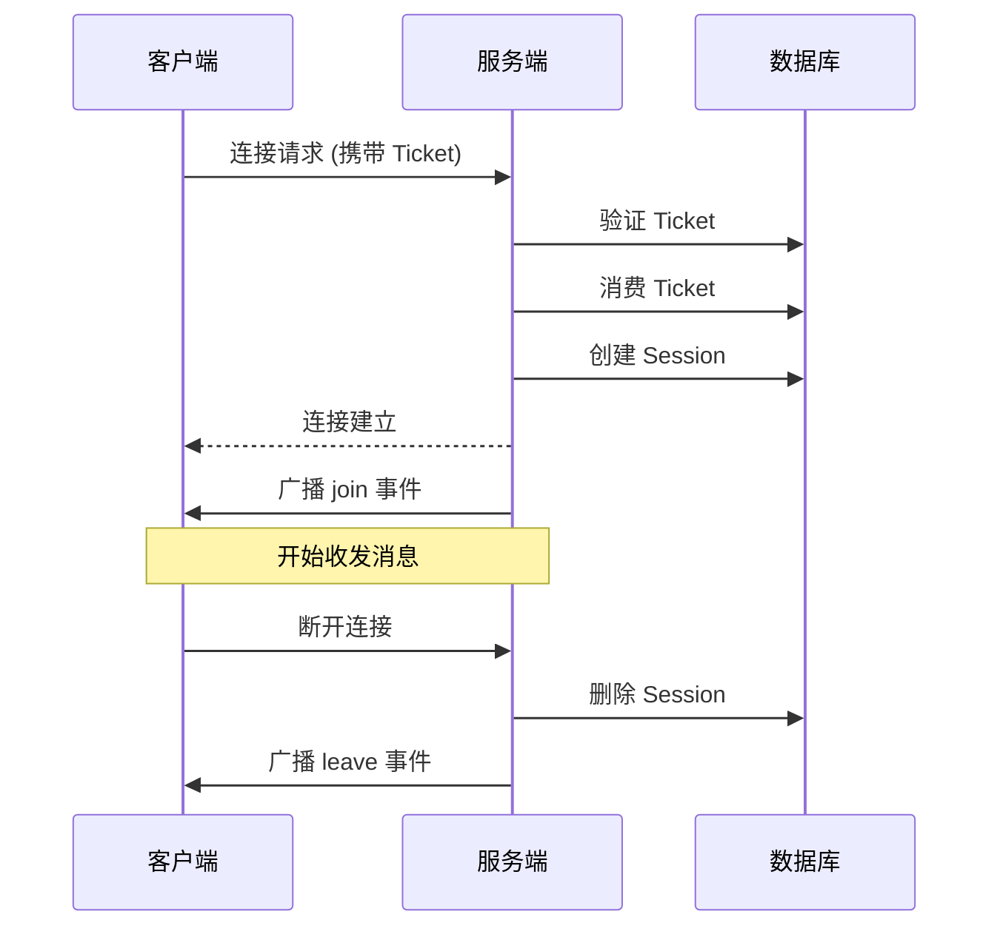

# WebSocket 协议

## 连接

### 建立连接

```
ws://localhost:8080/ws?room_id=<room_id>
Subprotocol: chatroom.v1, ticket.<your_ticket>
```

**连接参数**

| 参数 | 方式 | 描述 |
|------|------|------|
| room_id | Query String | 房间 ID |
| ticket | Subprotocol | 通过 `/api/v1/ws/tickets` 获取的 Ticket |

**JavaScript 示例**

```javascript
// 1. 获取 ticket
const ticketResp = await fetch('/api/v1/ws/tickets', {
  method: 'POST',
  headers: {
    'Authorization': `Bearer ${accessToken}`,
    'Content-Type': 'application/json'
  },
  body: JSON.stringify({ room_id: roomId })
})
const { ticket } = await ticketResp.json()

// 2. 建立 WebSocket 连接
const ws = new WebSocket(
  `ws://localhost:8080/ws?room_id=${roomId}`,
  ['chatroom.v1', `ticket.${ticket}`]
)
```

**连接生命周期**



## 客户端消息

### 发送聊天消息

```json
{
  "type": "message",
  "content": "Hello, everyone!"
}
```

| 字段 | 类型 | 约束 | 描述 |
|------|------|------|------|
| type | string | "message" | 消息类型 |
| content | string | 1-2000 字符 | 消息内容 |

### 发送心跳

```json
{
  "type": "ping"
}
```

### 发送输入状态

```json
{
  "type": "typing",
  "is_typing": true
}
```

## 服务端消息

### 聊天消息

```json
{
  "type": "message",
  "id": 123,
  "room_id": 1,
  "user_id": 1,
  "username": "alice",
  "content": "Hello, everyone!",
  "created_at": "2025-01-08T10:00:00Z"
}
```

### 用户加入

```json
{
  "type": "join",
  "room_id": 1,
  "user_id": 2,
  "username": "bob",
  "online": 5
}
```

### 用户离开

```json
{
  "type": "leave",
  "room_id": 1,
  "user_id": 2,
  "username": "bob",
  "online": 4
}
```

### 输入状态

```json
{
  "type": "typing",
  "room_id": 1,
  "user_id": 1,
  "username": "alice",
  "is_typing": true
}
```

### 心跳响应

```json
{
  "type": "pong"
}
```

### 错误消息

```json
{
  "type": "error",
  "content": "消息长度不能超过2000字符"
}
```

## 心跳机制

| 方向 | 间隔 | 超时 | 说明 |
|------|------|------|------|
| 客户端 → 服务端 | 30 秒 | - | 发送 `ping` |
| 服务端 → 客户端 | - | 60 秒 | 等待 `ping`，超时断开 |
| 服务端 → 客户端 | 30 秒 | - | 发送 `Ping` 帧 |
| 客户端 → 服务端 | - | - | 响应 `Pong` 帧 |

---

🌐 **Languages**: [English](/en/api/websocket) | 简体中文