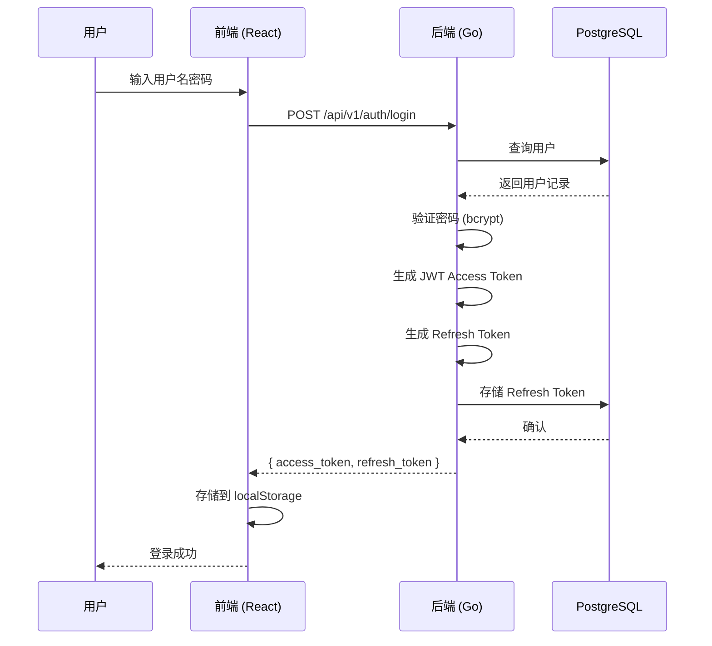
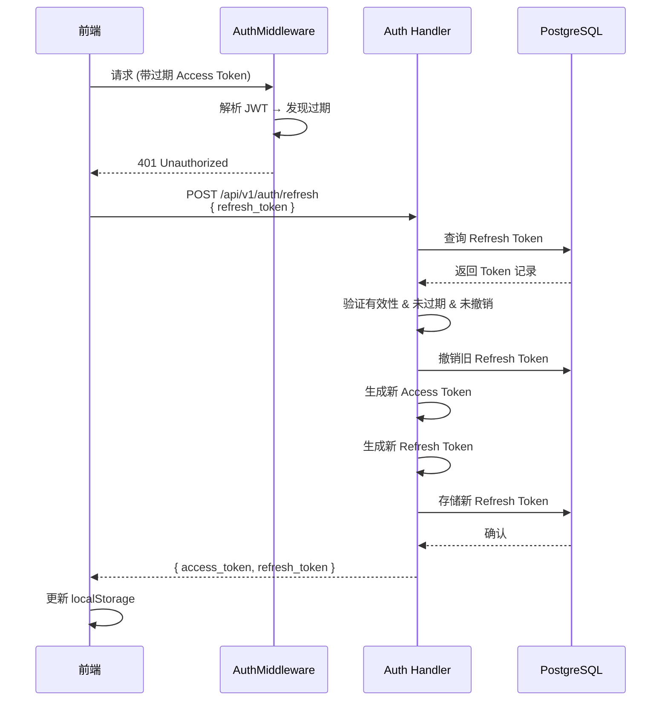
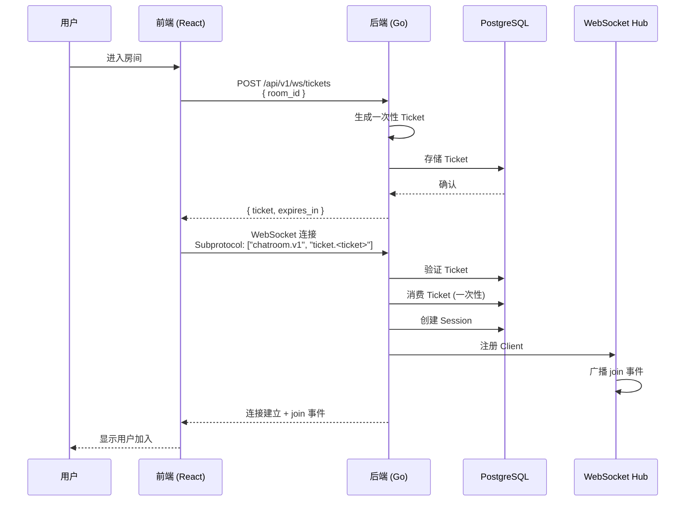
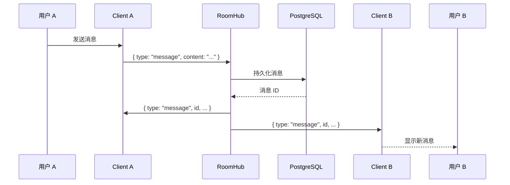
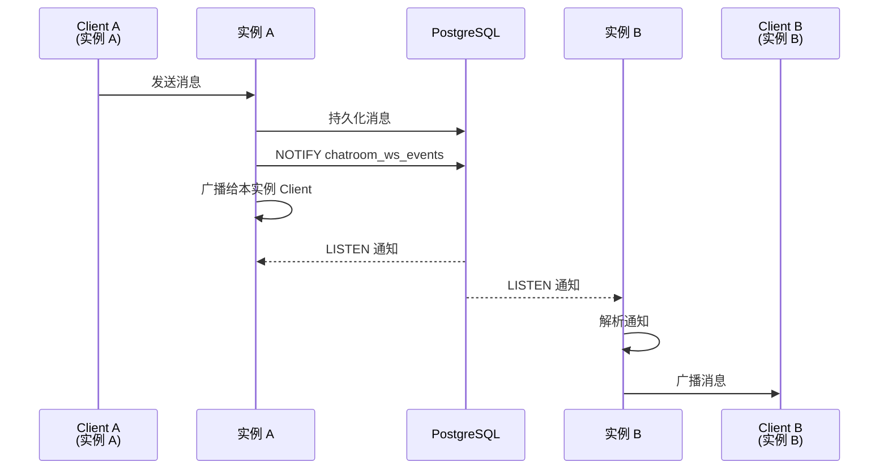
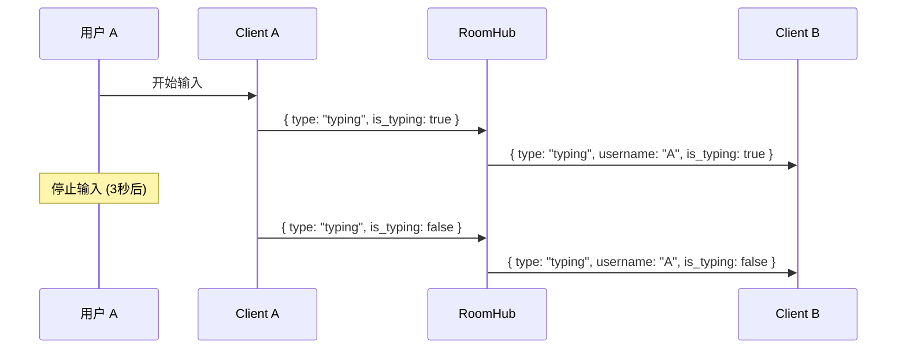

# 数据流

本文档分析 ChatRoom 中关键数据的流转路径。

## 认证流程

```mermaid
sequenceDiagram
    participant User as 用户
    participant FE as 前端 (React)
    participant BE as 后端 (Go)
    participant DB as PostgreSQL

    User->>FE: 输入用户名密码
    FE->>BE: POST /api/v1/auth/login
    BE->>DB: 查询用户
    DB-->>BE: 返回用户记录
    BE->>BE: 验证密码 (bcrypt)
    BE->>BE: 生成 JWT Access Token
    BE->>BE: 生成 Refresh Token
    BE->>DB: 存储 Refresh Token
    DB-->>BE: 确认
    BE-->>FE: { access_token, refresh_token }
    FE->>FE: 存储到 localStorage
    FE-->>User: 登录成功
```

## Token 刷新流程

```mermaid
sequenceDiagram
    participant FE as 前端
    participant MW as AuthMiddleware
    participant BE as Auth Handler
    participant DB as PostgreSQL

    FE->>MW: 请求 (带过期 Access Token)
    MW->>MW: 解析 JWT → 发现过期
    MW-->>FE: 401 Unauthorized
    
    FE->>BE: POST /api/v1/auth/refresh<br/>{ refresh_token }
    BE->>DB: 查询 Refresh Token
    DB-->>BE: 返回 Token 记录
    BE->>BE: 验证有效性 & 未过期 & 未撤销
    BE->>DB: 撤销旧 Refresh Token
    BE->>BE: 生成新 Access Token
    BE->>BE: 生成新 Refresh Token
    BE->>DB: 存储新 Refresh Token
    DB-->>BE: 确认
    BE-->>FE: { access_token, refresh_token }
    FE->>FE: 更新 localStorage
```

## WebSocket 连接流程

```mermaid
sequenceDiagram
    participant User as 用户
    participant FE as 前端 (React)
    participant BE as 后端 (Go)
    participant DB as PostgreSQL
    participant Hub as WebSocket Hub

    User->>FE: 进入房间
    FE->>BE: POST /api/v1/ws/tickets<br/>{ room_id }
    BE->>BE: 生成一次性 Ticket
    BE->>DB: 存储 Ticket
    DB-->>BE: 确认
    BE-->>FE: { ticket, expires_in }

    FE->>BE: WebSocket 连接<br/>Subprotocol: ["chatroom.v1", "ticket.<ticket>"]
    BE->>DB: 验证 Ticket
    BE->>DB: 消费 Ticket (一次性)
    BE->>DB: 创建 Session
    BE->>Hub: 注册 Client
    Hub->>Hub: 广播 join 事件
    BE-->>FE: 连接建立 + join 事件
    FE-->>User: 显示用户加入
```

## 消息流转

```mermaid
sequenceDiagram
    participant UserA as 用户 A
    participant ClientA as Client A
    participant Hub as RoomHub
    participant DB as PostgreSQL
    participant ClientB as Client B
    participant UserB as 用户 B

    UserA->>ClientA: 发送消息
    ClientA->>Hub: { type: "message", content: "..." }
    Hub->>DB: 持久化消息
    DB-->>Hub: 消息 ID
    Hub->>ClientA: { type: "message", id, ... }
    Hub->>ClientB: { type: "message", id, ... }
    ClientB-->>UserB: 显示新消息
```

## 分布式消息同步

```mermaid
sequenceDiagram
    participant ClientA as Client A<br/>(实例 A)
    participant InstanceA as 实例 A
    participant PG as PostgreSQL
    participant InstanceB as 实例 B
    participant ClientB as Client B<br/>(实例 B)

    ClientA->>InstanceA: 发送消息
    InstanceA->>PG: 持久化消息
    InstanceA->>PG: NOTIFY chatroom_ws_events
    InstanceA->>InstanceA: 广播给本实例 Client

    PG-->>InstanceA: LISTEN 通知
    PG-->>InstanceB: LISTEN 通知
    
    InstanceB->>InstanceB: 解析通知
    InstanceB->>ClientB: 广播消息
```

## 输入状态流

```mermaid
sequenceDiagram
    participant UserA as 用户 A
    participant ClientA as Client A
    participant Hub as RoomHub
    participant ClientB as Client B

    UserA->>ClientA: 开始输入
    ClientA->>Hub: { type: "typing", is_typing: true }
    Hub->>ClientB: { type: "typing", username: "A", is_typing: true }
    
    Note over UserA: 停止输入 (3秒后)
    ClientA->>Hub: { type: "typing", is_typing: false }
    Hub->>ClientB: { type: "typing", username: "A", is_typing: false }
```

---

🌐 **Languages**: [English](/en/architecture/data-flow) | 简体中文