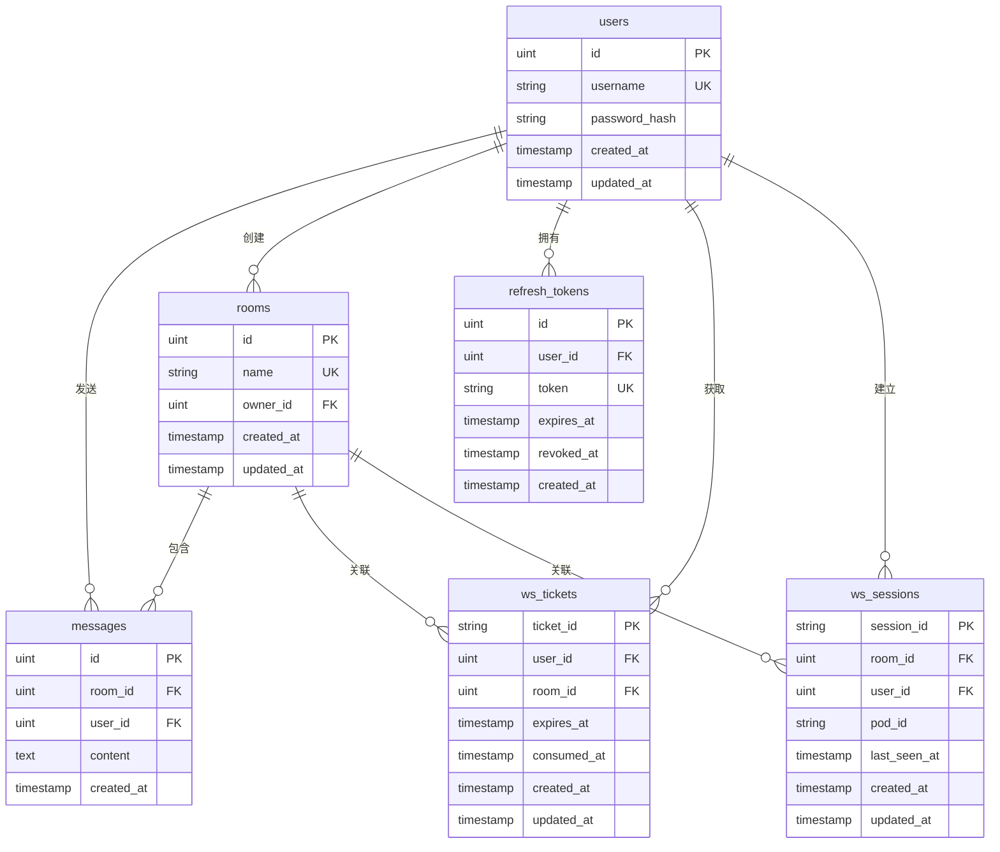

# 数据模型

本文档描述 ChatRoom 的数据库设计。

## ER 图

## 表说明

| 表名 | 用途 | 关键索引 |
|------|------|----------|
| `users` | 用户账户 | username (unique) |
| `rooms` | 聊天房间 | name (unique), owner_id |
| `messages` | 聊天消息 | room_id, user_id, created_at |
| `refresh_tokens` | 刷新令牌 | user_id, token (unique), expires_at |
| `ws_tickets` | WebSocket 认证票据 | user_id, room_id, expires_at |
| `ws_sessions` | WebSocket 会话（分布式在线统计） | room_id, user_id, pod_id |

## 详细字段说明

### users 表

| 字段 | 类型 | 约束 | 说明 |
|------|------|------|------|
| id | SERIAL | PRIMARY KEY | 自增主键 |
| username | VARCHAR(64) | UNIQUE, NOT NULL | 用户名，唯一 |
| password_hash | VARCHAR(256) | NOT NULL | bcrypt 哈希后的密码 |
| created_at | TIMESTAMP | NOT NULL | 创建时间 |
| updated_at | TIMESTAMP | NOT NULL | 更新时间 |

### rooms 表

| 字段 | 类型 | 约束 | 说明 |
|------|------|------|------|
| id | SERIAL | PRIMARY KEY | 自增主键 |
| name | VARCHAR(128) | UNIQUE, NOT NULL | 房间名，唯一 |
| owner_id | INTEGER | FOREIGN KEY | 创建者 ID |
| created_at | TIMESTAMP | NOT NULL | 创建时间 |
| updated_at | TIMESTAMP | NOT NULL | 更新时间 |

### messages 表

| 字段 | 类型 | 约束 | 说明 |
|------|------|------|------|
| id | SERIAL | PRIMARY KEY | 自增主键 |
| room_id | INTEGER | FOREIGN KEY, NOT NULL | 所属房间 ID |
| user_id | INTEGER | FOREIGN KEY, NOT NULL | 发送者 ID |
| content | TEXT | NOT NULL | 消息内容，最大 2000 字符 |
| created_at | TIMESTAMP | NOT NULL | 创建时间 |

### refresh_tokens 表

| 字段 | 类型 | 约束 | 说明 |
|------|------|------|------|
| id | SERIAL | PRIMARY KEY | 自增主键 |
| user_id | INTEGER | FOREIGN KEY, NOT NULL | 所属用户 ID |
| token | VARCHAR(64) | UNIQUE, NOT NULL | 随机生成的 Token |
| expires_at | TIMESTAMP | NOT NULL | 过期时间 |
| revoked_at | TIMESTAMP | | 撤销时间（Token Rotation 时设置） |
| created_at | TIMESTAMP | NOT NULL | 创建时间 |

### ws_tickets 表

| 字段 | 类型 | 约束 | 说明 |
|------|------|------|------|
| ticket_id | VARCHAR(64) | PRIMARY KEY | 随机生成的票据 ID |
| user_id | INTEGER | FOREIGN KEY, NOT NULL | 所属用户 ID |
| room_id | INTEGER | FOREIGN KEY, NOT NULL | 目标房间 ID |
| expires_at | TIMESTAMP | NOT NULL | 过期时间（默认 60 秒） |
| consumed_at | TIMESTAMP | | 消费时间（使用后设置） |
| created_at | TIMESTAMP | NOT NULL | 创建时间 |
| updated_at | TIMESTAMP | NOT NULL | 更新时间 |

### ws_sessions 表

| 字段 | 类型 | 约束 | 说明 |
|------|------|------|------|
| session_id | VARCHAR(64) | PRIMARY KEY | 会话 ID |
| room_id | INTEGER | FOREIGN KEY, NOT NULL | 所属房间 ID |
| user_id | INTEGER | FOREIGN KEY, NOT NULL | 所属用户 ID |
| pod_id | VARCHAR(64) | NOT NULL | 实例标识（分布式场景） |
| last_seen_at | TIMESTAMP | NOT NULL | 最后心跳时间 |
| created_at | TIMESTAMP | NOT NULL | 创建时间 |
| updated_at | TIMESTAMP | NOT NULL | 更新时间 |

---

🌐 **Languages**: [English](/en/architecture/data-model) | 简体中文