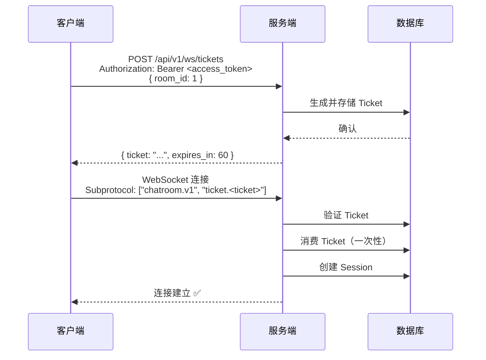

# ADR-001: WebSocket 认证方案选择

- **状态**: ✅ 已采纳
- **日期**: 2025-01-15
- **决策者**: @LessUp

## 背景

WebSocket 连接需要身份认证，但存在以下技术限制：

1. **WebSocket 握手不支持自定义 Header**：浏览器 WebSocket API 不允许在握手时设置 `Authorization` Header
2. **浏览器 API 限制**：`new WebSocket(url)` 不提供设置自定义请求头的方式
3. **安全要求**：需要防止 Token 泄露和重放攻击

这意味着传统的 Bearer Token 认证方式无法直接应用于 WebSocket 连接。

## 决策

采用**一次性 Ticket 认证方案**：

1. 客户端先通过 REST API 获取一次性 Ticket
2. 客户端在 WebSocket 握手时通过 Subprotocol 传递 Ticket
3. 服务端验证 Ticket 后立即消费（一次性使用）



### Ticket 设计

| 属性 | 值 | 说明 |
|------|-----|------|
| 有效期 | 60 秒 | 短期有效，防止重放 |
| 使用次数 | 1 次 | 一次性消费 |
| 绑定 | 特定 room_id | 防止跨房间滥用 |
| 传递方式 | WebSocket Subprotocol | 不暴露在 URL 中 |

## 后果

### ✅ 正面

- **安全性高**：Ticket 不出现在 URL 中，不会泄露到服务器日志、代理日志、浏览器历史
- **防重放攻击**：一次性使用 + 短有效期
- **无缝集成**：与现有 JWT 体系集成，无需额外认证机制
- **符合规范**：使用 WebSocket Subprotocol 传递，符合 RFC 6455

### ⚠️ 负面

- **额外请求**：每次 WebSocket 连接需要一次 HTTP 请求获取 Ticket
- **生命周期管理**：需要管理 Ticket 的过期清理（通过 `db.StartCleanup()` 实现）
- **分布式复杂性**：多实例场景需要共享 Ticket 存储（通过 PostgreSQL 数据库解决）

## 替代方案

### ❌ URL 参数传递 Token

```
ws://host/ws?token=<jwt>
```

**拒绝理由**：
- JWT 会出现在 URL 中
- URL 会记录在服务器访问日志、代理日志、浏览器历史、Referrer Header 中
- Token 可能被中间人截获
- 违反安全最佳实践

### ❌ Cookie 认证

```javascript
// 依赖浏览器自动发送 Cookie
const ws = new WebSocket('ws://host/ws');
```

**拒绝理由**：
- 不符合 SPA 架构，前端使用 localStorage 而非 Cookie
- 跨域 WebSocket 连接的 Cookie 处理复杂
- 存在 CSRF 风险
- 移动端和非浏览器客户端支持差

### ❌ Subprotocol 直接传递 JWT

```javascript
const ws = new WebSocket(url, ['chatroom.v1', `token.<jwt>`]);
```

**拒绝理由**：
- JWT 有较长的有效期（15分钟），可被重放
- JWT 不支持一次性消费机制
- 如果 JWT 泄露，攻击窗口较大
- 无法绑定到特定房间

---

🌐 **Languages**: [English](/en/decisions/001-ws-auth) | 简体中文