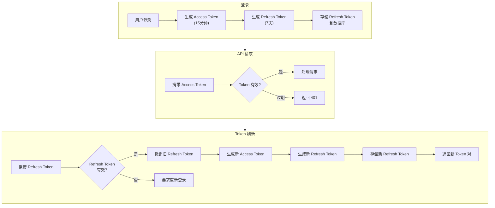

# ADR-002: Token Rotation 策略

- **状态**: ✅ 已采纳
- **日期**: 2025-01-20
- **决策者**: @LessUp

## 背景

用户认证需要 Token 来验证身份。传统单 Token 方案存在以下问题：

1. **长期 Token 的风险**：如果 Token 泄露，攻击者可以在 Token 有效期内冒充用户
2. **短期 Token 的体验**：频繁重新登录影响用户体验
3. **安全与便利的平衡**：需要在安全性和用户体验之间找到平衡点

## 决策

采用**双 Token + Token Rotation 策略**：



### Token 设计

| Token 类型 | 有效期 | 存储位置 | 用途 |
|-----------|--------|----------|------|
| Access Token | 15 分钟 | 前端内存 / localStorage | API 请求认证 |
| Refresh Token | 7 天 | 数据库 + 前端 localStorage | 刷新 Access Token |

### Token Rotation 流程

每次刷新都会：
1. 验证 Refresh Token 的有效性
2. **撤销**旧 Refresh Token
3. 签发**新的** Access Token + Refresh Token 对

## 后果

### ✅ 正面

- **最小化泄露窗口**：Access Token 短期有效，即使泄露也只有 15 分钟的风险窗口
- **无感刷新**：用户无需频繁登录，Refresh Token 自动获取新 Access Token
- **可追溯性**：Refresh Token 存储在数据库，可审计和撤销
- **自动清理**：过期 Refresh Token 通过定时任务清理

### ⚠️ 负面

- **复杂性增加**：需要管理两种 Token 的生命周期
- **数据库依赖**：Refresh Token 需要数据库存储，增加数据库负载
- **并发刷新**：多次并发刷新可能导致 Token 失效，需要客户端重试机制

## 替代方案

### ❌ 单一长期 Token

```
Token 有效期: 7 天
```

**拒绝理由**：
- Token 泄露后，攻击者有 7 天的时间冒充用户
- 无法主动撤销（除非引入黑名单）
- 不符合 OAuth 2.0 安全最佳实践

### ❌ 单一短期 Token

```
Token 有效期: 15 分钟
无 Refresh Token
```

**拒绝理由**：
- 用户每 15 分钟需要重新登录
- 严重影响用户体验
- 频繁登录增加服务器负载

### ❌ Session-based 认证

```
服务端 Session + Cookie
```

**拒绝理由**：
- 需要服务端存储 Session 状态
- 分布式场景需要 Session 共享（Redis 等）
- 不符合 SPA 和移动端架构
- 跨域 Cookie 处理复杂

## 配置参数

| 环境变量 | 默认值 | 说明 |
|----------|--------|------|
| `ACCESS_TOKEN_TTL_MINUTES` | 15 | Access Token 有效期（分钟） |
| `REFRESH_TOKEN_TTL_DAYS` | 7 | Refresh Token 有效期（天） |

---

🌐 **Languages**: [English](/en/decisions/002-token-rotation) | 简体中文