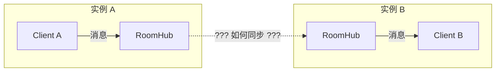
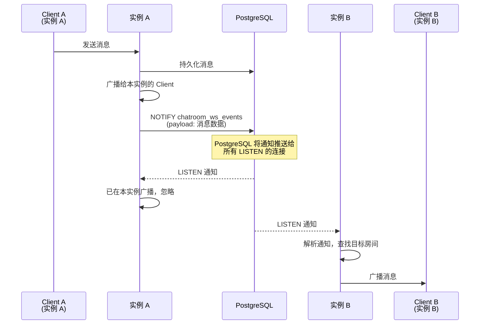
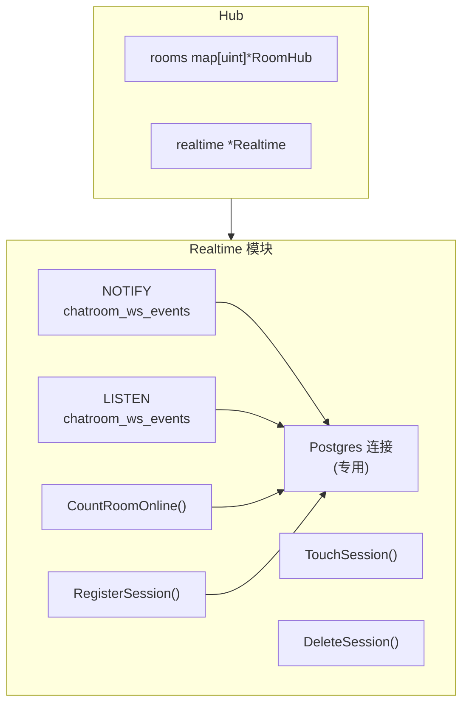

# ADR-003: 分布式消息同步方案

- **状态**: ✅ 已采纳
- **日期**: 2025-02-01
- **决策者**: @LessUp

## 背景

当 ChatRoom 部署为多个实例时，WebSocket 连接分布在不同实例上。用户 A 连接到实例 1 发送的消息，需要到达连接到实例 2 的用户 B。这需要跨实例的消息同步机制。



## 决策

采用 **PostgreSQL LISTEN/NOTIFY** 实现跨实例消息广播：



### 架构设计



### 会话管理

通过 `ws_sessions` 表实现分布式在线状态统计：

| 操作 | 说明 |
|------|------|
| `RegisterSession` | 连接建立时注册会话 |
| `TouchSession` | 心跳时更新最后活跃时间 |
| `DeleteSession` | 断开时删除会话 |
| `CountRoomOnline` | 聚合所有实例的在线人数 |

## 后果

### ✅ 正面

- **零额外依赖**：不需要 Redis、Kafka 或其他消息中间件
- **架构简洁**：利用已有的 PostgreSQL，运维成本低
- **低延迟**：Postgres NOTIFY 是即时的（毫秒级）
- **事务一致性**：消息持久化和通知在同一个事务中
- **自动重连**：Postgres 驱动支持 LISTEN 连接断开后自动重连

### ⚠️ 负面

- **通知大小限制**：Postgres NOTIFY payload 最大 8000 字节
- **不保证送达**：LISTEN/NOTIFY 是 best-effort，如果实例暂时断开连接可能丢失通知
- **单数据库依赖**：所有实例必须连接同一个 PostgreSQL
- **不适合超高吞吐**：大量消息场景可能需要更专业的消息队列
- **轮询统计**：在线人数统计需要查询数据库，非实时精确

## 替代方案

### ❌ Redis Pub/Sub

```
Publisher → Redis → Subscribers
```

**拒绝理由**：
- 引入新的基础设施依赖
- 增加运维复杂度（需要维护 Redis 集群）
- 对于教学项目来说过于重量级
- 消息不持久，Redis 重启后丢失

**适用场景**：当消息吞吐量超过 Postgres NOTIFY 的承载能力时

### ❌ Kafka / RabbitMQ

```
Producer → Message Queue → Consumers
```

**拒绝理由**：
- 严重过度设计，对于聊天室应用太重
- 运维成本极高
- 增加团队学习曲线
- 部署复杂度大幅增加

**适用场景**：企业级大规模分布式系统

### ❌ 轮询数据库

```
每 N 秒查询 messages 表获取新消息
```

**拒绝理由**：
- 延迟太高（取决于轮询间隔）
- 数据库负载大（频繁查询）
- 浪费资源（大部分查询无新消息）

---

🌐 **Languages**: [English](/en/decisions/003-distributed-sync) | 简体中文