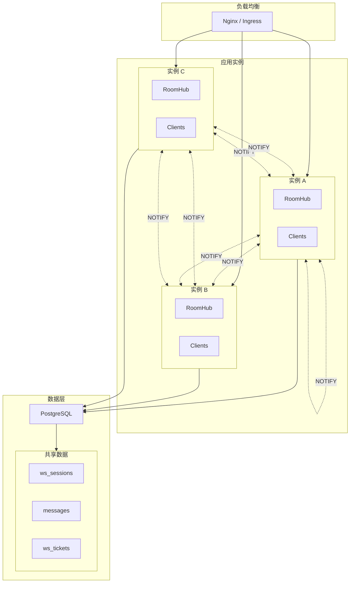
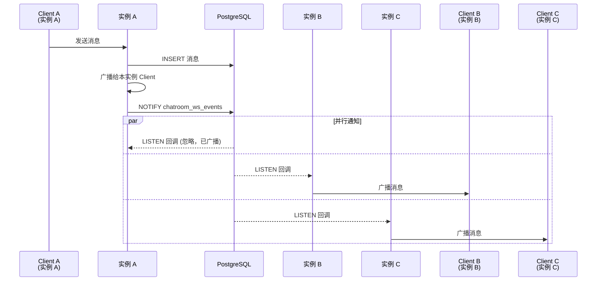
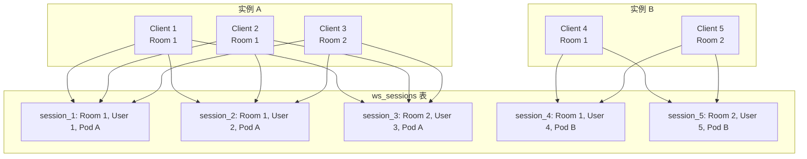

# 水平扩展

本文档描述 ChatRoom 的多实例部署设计和扩展策略。

## 当前架构



## 跨实例消息同步

### 工作原理

每个应用实例：
1. **LISTEN** 到 PostgreSQL 的 `chatroom_ws_events` 通道
2. 发送消息时，**NOTIFY** 所有其他实例
3. 收到通知时，查找本地 RoomHub 并广播



### 通知 Payload 格式

```json
{
  "room_id": 1,
  "data": {
    "type": "message",
    "id": 123,
    "content": "Hello!",
    "username": "alice"
  }
}
```

## 分布式在线状态

### 会话管理



### 在线人数查询

```sql
-- 查询 Room 1 的在线人数（聚合所有实例）
SELECT COUNT(DISTINCT user_id) 
FROM ws_sessions 
WHERE room_id = 1 
  AND last_seen_at > NOW() - INTERVAL '45 seconds';
```

## 负载均衡策略

### WebSocket 连接路由

| 策略 | 说明 | 优缺点 |
|------|------|--------|
| **Round Robin** | 轮询分配 | 简单，但可能不均匀 |
| **Least Connections** | 分配到连接数最少的实例 | 推荐，分布更均匀 |
| **Sticky Sessions** | 同一用户路由到同一实例 | 减少跨实例通信，但限制故障转移 |

### 推荐：Least Connections

```
upstream chatroom {
    least_conn;
    server 10.0.0.1:8080;
    server 10.0.0.2:8080;
    server 10.0.0.3:8080;
}
```

## 扩展点

### 当前已实现

1. **PostgreSQL NOTIFY**：跨实例消息广播
2. **ws_sessions 表**：分布式在线状态
3. **无状态 API**：所有实例共享同一数据库
4. **PodID 标识**：每个实例有唯一标识

### 未来扩展

| 扩展方向 | 实现思路 | 复杂度 |
|----------|----------|--------|
| Redis Pub/Sub | 替换 Postgres NOTIFY，更高吞吐 | 中 |
| 消息持久化 | Kafka 处理消息流 | 高 |
| 私密房间 | rooms 表添加 visibility 字段 | 低 |
| 消息搜索 | Elasticsearch 全文索引 | 中 |
| 文件上传 | 对象存储 + 预签名 URL | 中 |
| 端到端加密 | Signal Protocol | 极高 |

---

🌐 **Languages**: [English](/en/deep-dives/scalability/horizontal) | 简体中文