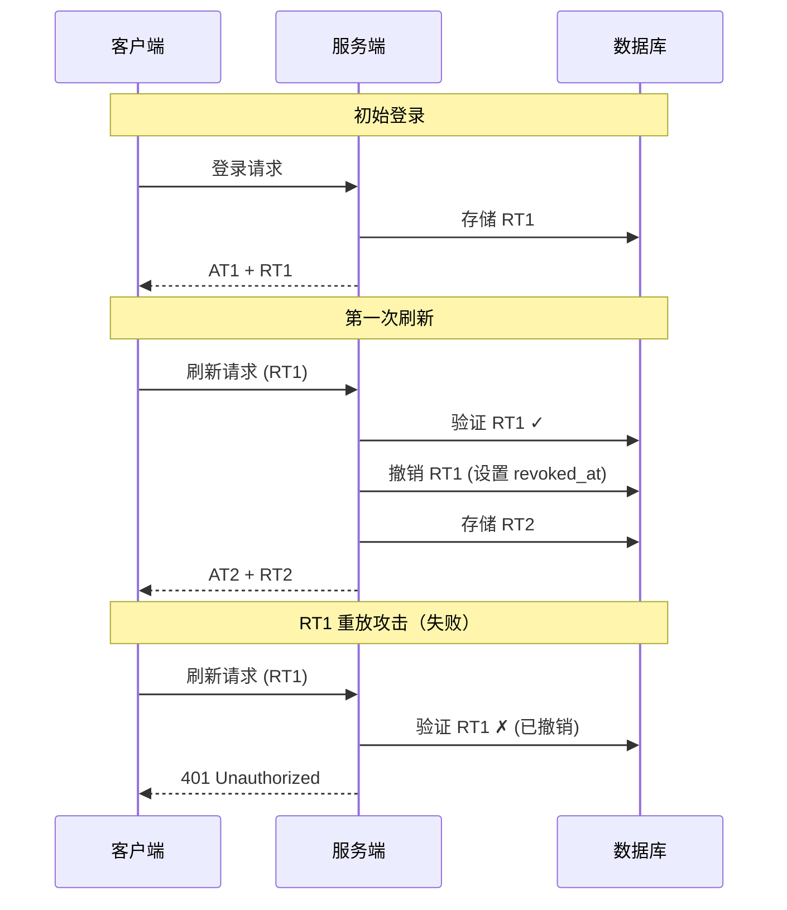
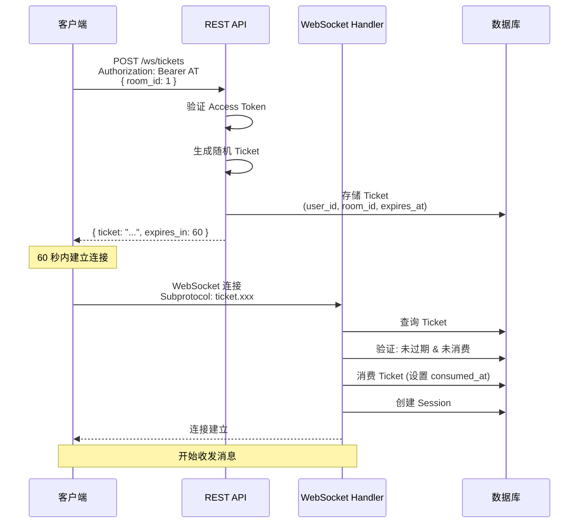

# 认证深度分析

本文档深入分析 ChatRoom 的认证机制实现细节。

## JWT 结构

### Access Token

```json
{
  "header": {
    "alg": "HS256",
    "typ": "JWT"
  },
  "payload": {
    "sub": "1",
    "username": "alice",
    "exp": 1704705600,
    "iat": 1704704700
  },
  "signature": "..."
}
```

| 字段 | 说明 |
|------|------|
| `sub` | 用户 ID |
| `username` | 用户名（避免每次查库） |
| `exp` | 过期时间（15 分钟） |
| `iat` | 签发时间 |

### Refresh Token

随机生成的 64 字节十六进制字符串，存储在数据库：

```sql
SELECT * FROM refresh_tokens WHERE token = '...';
```

## 认证流程

### 完整认证流程

```mermaid
flowchart TB
    subgraph Login["登录"]
        L1["用户输入"] --> L2["POST /auth/login"]
        L2 --> L3["查询用户"]
        L3 --> L4["bcrypt 验证密码"]
        L4 --> L5["生成 Access Token"]
        L5 --> L6["生成 Refresh Token"]
        L6 --> L7["存储 Refresh Token"]
        L7 --> L8["返回 Token 对"]
    end
    
    subgraph API["API 请求"]
        A1["携带 Access Token"] --> A2["AuthMiddleware"]
        A2 --> A3["解析 JWT"]
        A3 --> A4{"验证签名 & 过期"}
        A4 -->|有效| A5["注入用户信息"]
        A4 -->|过期| A6["返回 401"]
        A5 --> A7["继续处理请求"]
    end
    
    subgraph Refresh["Token 刷新"]
        R1["携带 Refresh Token"] --> R2["查询数据库"]
        R2 --> R3{"验证有效性"}
        R3 -->|有效| R4["撤销旧 Token"]
        R4 --> R5["生成新 Token 对"]
        R5 --> R6["存储新 Refresh Token"]
        R3 -->|无效| R7["返回 401"]
    end
```



### Token Rotation 详解



## WebSocket Ticket 流程

### 为什么需要 Ticket？

WebSocket 握手无法携带 Authorization Header，需要替代认证方式。

### Ticket 生命周期



### Ticket 安全特性

| 特性 | 实现 | 防护目标 |
|------|------|----------|
| 一次性使用 | `consumed_at` 字段 | 重放攻击 |
| 短有效期 | 60 秒 | Token 泄露 |
| 房间绑定 | `room_id` 字段 | 跨房间滥用 |
| 用户绑定 | `user_id` 字段 | 身份冒充 |
| 不暴露在 URL | Subprotocol 传递 | 日志泄露 |

## 密码安全

### bcrypt 哈希

```go
// 哈希密码
hash, _ := bcrypt.GenerateFromPassword([]byte(password), bcrypt.DefaultCost)

// 验证密码
err := bcrypt.CompareHashAndPassword([]byte(hash), []byte(password))
```

| 参数 | 值 | 说明 |
|------|-----|------|
| Cost | 10 (默认) | 2^10 = 1024 轮迭代 |
| 输出长度 | 60 字符 | 固定长度哈希 |
| 包含 Salt | 是 | 防止彩虹表攻击 |

### 为什么不用其他算法？

| 算法 | 说明 |
|------|------|
| MD5/SHA1 | 已被破解，不安全 |
| SHA256/SHA512 | 需要 separate salt，易出错 |
| Argon2 | 更安全，但 bcrypt 足够用 |
| PBKDF2 | 类似 bcrypt，但实现更复杂 |

---

🌐 **Languages**: [English](/en/deep-dives/security/auth-deep-dive) | 简体中文