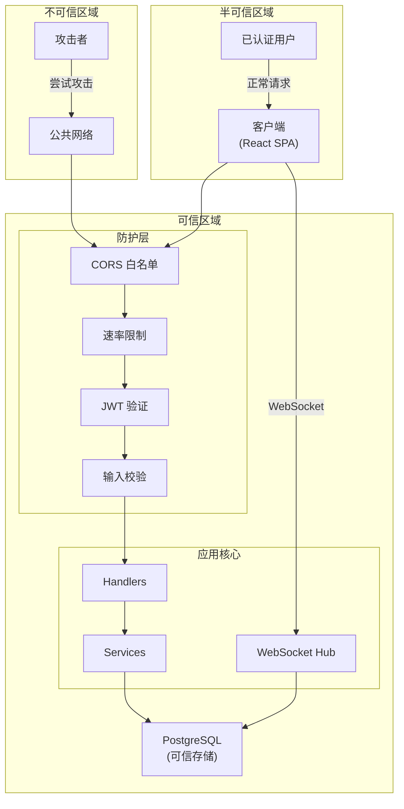

# 威胁模型

本文档分析 ChatRoom 的安全威胁模型和缓解措施。

## 信任边界

## 威胁分析

### STRIDE 威胁分类

| 威胁类型 | 威胁描述 | 缓解措施 |
|----------|----------|----------|
| **Spoofing** (欺骗) | 攻击者冒充合法用户 | JWT 认证 + Token Rotation |
| **Tampering** (篡改) | 修改传输中的数据 | HTTPS + JWT 签名验证 |
| **Repudiation** (抵赖) | 用户否认执行过操作 | 审计日志 + 消息持久化 |
| **Information Disclosure** (信息泄露) | 敏感数据泄露 | 密码哈希 + Token 短有效期 |
| **Denial of Service** (拒绝服务) | 使服务不可用 | 速率限制 + 连接数限制 |
| **Elevation of Privilege** (权限提升) | 获取未授权权限 | 严格权限检查 |

## 威胁与缓解措施详情

### 密码泄露

| 属性 | 值 |
|------|-----|
| 风险等级 | 高 |
| 威胁 | 数据库泄露导致用户密码暴露 |
| 缓解措施 | bcrypt 哈希 (cost=10)，不可逆 |
| 残余风险 | 暴力破解弱密码 |

### Token 泄露

| 属性 | 值 |
|------|-----|
| 风险等级 | 高 |
| 威胁 | Access Token 被截获 |
| 缓解措施 | 短有效期 (15分钟) + HTTPS |
| 残余风险 | 15 分钟内的冒充攻击 |

### Refresh Token 泄露

| 属性 | 值 |
|------|-----|
| 风险等级 | 高 |
| 威胁 | Refresh Token 被截获 |
| 缓解措施 | Token Rotation (每次刷新撤销旧 Token) |
| 残余风险 | 并发刷新导致的竞态条件 |

### 重放攻击

| 属性 | 值 |
|------|-----|
| 风险等级 | 中 |
| 威胁 | 截获并重放 WebSocket Ticket |
| 缓解措施 | 一次性消费 + 60 秒有效期 |
| 残余风险 | 60 秒内的重放 |

### 暴力破解

| 属性 | 值 |
|------|-----|
| 风险等级 | 中 |
| 威胁 | 暴力尝试用户名/密码组合 |
| 缓解措施 | 速率限制 (10 次/分钟/IP) |
| 残余风险 | 分布式暴力破解 |

### XSS (跨站脚本)

| 属性 | 值 |
|------|-----|
| 风险等级 | 中 |
| 威胁 | 注入恶意脚本执行 |
| 缓解措施 | 输入校验 + React 自动转义 |
| 残余风险 | 用户生成内容中的 XSS |

### CSRF (跨站请求伪造)

| 属性 | 值 |
|------|-----|
| 风险等级 | 低 |
| 威胁 | 跨站发起伪造请求 |
| 缓解措施 | 不使用 Cookie + SameSite 策略 |
| 残余风险 | 无 |

### SQL 注入

| 属性 | 值 |
|------|-----|
| 风险等级 | 低 |
| 威胁 | 注入恶意 SQL 语句 |
| 缓解措施 | GORM 参数化查询 |
| 残余风险 | 无 |

## OWASP Top 10 检查清单

| OWASP 风险 | 状态 | 说明 |
|------------|------|------|
| A01: Broken Access Control | ✅ | JWT 验证 + 路由权限检查 |
| A02: Cryptographic Failures | ✅ | bcrypt + HTTPS |
| A03: Injection | ✅ | GORM 参数化 + 输入校验 |
| A04: Insecure Design | ✅ | 威胁模型驱动设计 |
| A05: Security Misconfiguration | ⚠️ | 依赖生产环境配置 |
| A06: Vulnerable Components | ⚠️ | 需要定期依赖审计 |
| A07: Auth Failures | ✅ | Token Rotation + 速率限制 |
| A08: Software & Data Integrity | ✅ | JWT 签名验证 |
| A09: Security Logging | ✅ | zerolog 结构化日志 |
| A10: SSRF | N/A | 不涉及外部请求 |

## 生产环境安全检查清单

- [ ] JWT_SECRET 使用强随机密钥（≥32 字节）
- [ ] 启用 HTTPS（TLS 1.2+）
- [ ] 数据库使用强密码，限制网络访问
- [ ] ALLOWED_ORIGINS 严格配置，不使用 `*`
- [ ] 定期更新依赖，修复已知漏洞
- [ ] 启用审计日志
- [ ] 配置监控告警

---

🌐 **Languages**: [English](/en/deep-dives/security/threat-model) | 简体中文