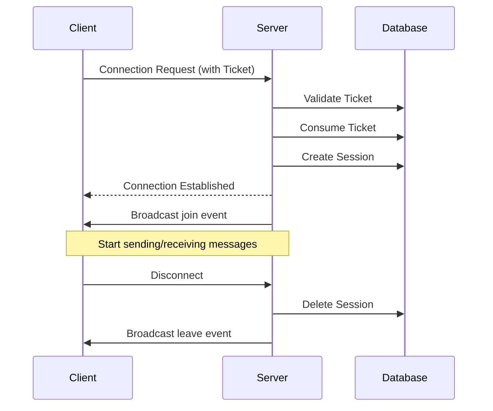

# WebSocket Protocol

## Connection

### Establishing Connection

```
ws://localhost:8080/ws?room_id=<room_id>
Subprotocol: chatroom.v1, ticket.<your_ticket>
```

**Connection Parameters**

| Parameter | Method | Description |
|-----------|--------|-------------|
| room_id | Query String | Room ID |
| ticket | Subprotocol | Ticket obtained via `/api/v1/ws/tickets` |

**JavaScript Example**

```javascript
// 1. Get ticket
const ticketResp = await fetch('/api/v1/ws/tickets', {
  method: 'POST',
  headers: {
    'Authorization': `Bearer ${accessToken}`,
    'Content-Type': 'application/json'
  },
  body: JSON.stringify({ room_id: roomId })
})
const { ticket } = await ticketResp.json()

// 2. Establish WebSocket connection
const ws = new WebSocket(
  `ws://localhost:8080/ws?room_id=${roomId}`,
  ['chatroom.v1', `ticket.${ticket}`]
)
```

**Connection Lifecycle**



## Client Messages

### Send Chat Message

```json
{
  "type": "message",
  "content": "Hello, everyone!"
}
```

| Field | Type | Constraint | Description |
|-------|------|------------|-------------|
| type | string | "message" | Message type |
| content | string | 1-2000 characters | Message content |

### Send Heartbeat

```json
{
  "type": "ping"
}
```

### Send Typing Status

```json
{
  "type": "typing",
  "is_typing": true
}
```

## Server Messages

### Chat Message

```json
{
  "type": "message",
  "id": 123,
  "room_id": 1,
  "user_id": 1,
  "username": "alice",
  "content": "Hello, everyone!",
  "created_at": "2025-01-08T10:00:00Z"
}
```

### User Join

```json
{
  "type": "join",
  "room_id": 1,
  "user_id": 2,
  "username": "bob",
  "online": 5
}
```

### User Leave

```json
{
  "type": "leave",
  "room_id": 1,
  "user_id": 2,
  "username": "bob",
  "online": 4
}
```

### Typing Status

```json
{
  "type": "typing",
  "room_id": 1,
  "user_id": 1,
  "username": "alice",
  "is_typing": true
}
```

### Heartbeat Response

```json
{
  "type": "pong"
}
```

### Error Message

```json
{
  "type": "error",
  "content": "Message length cannot exceed 2000 characters"
}
```

## Heartbeat Mechanism

| Direction | Interval | Timeout | Description |
|-----------|----------|---------|-------------|
| Client → Server | 30 seconds | - | Send `ping` |
| Server → Client | - | 60 seconds | Wait for `ping`, disconnect on timeout |
| Server → Client | 30 seconds | - | Send `Ping` frame |
| Client → Server | - | - | Respond with `Pong` frame |

---

🌐 **Languages**: English | [简体中文](/en/api/websocket)
