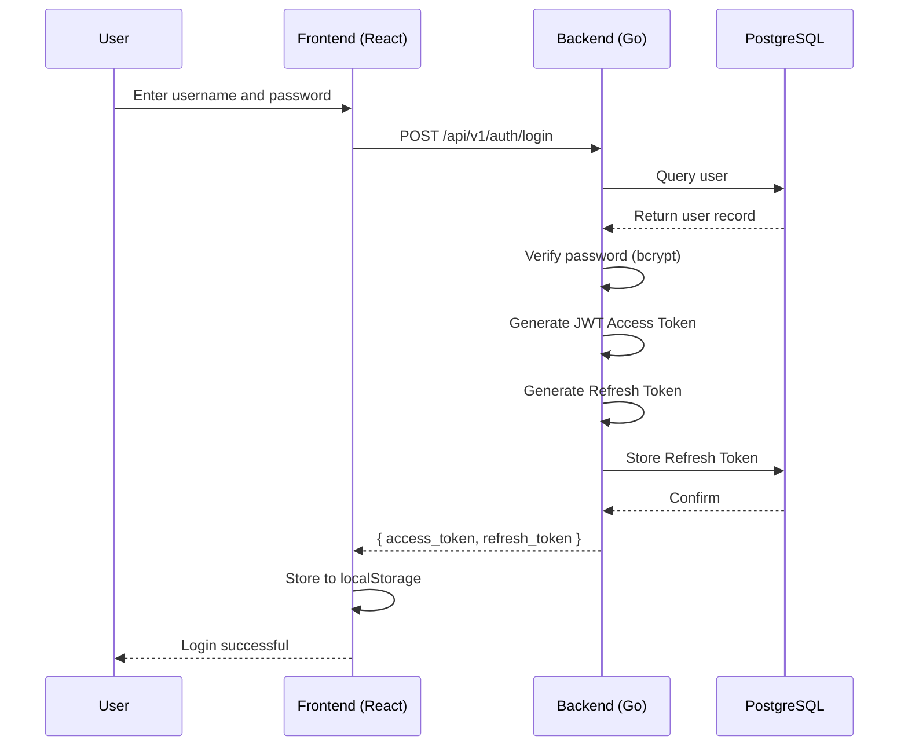
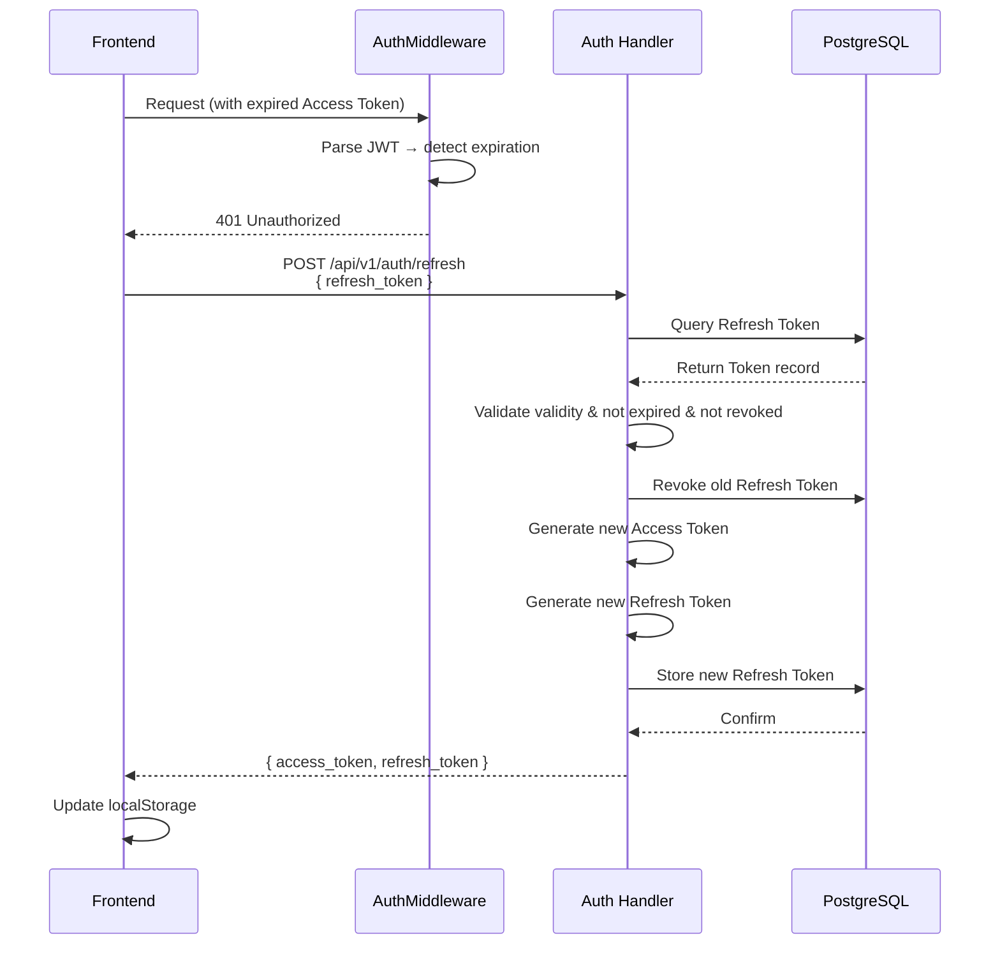
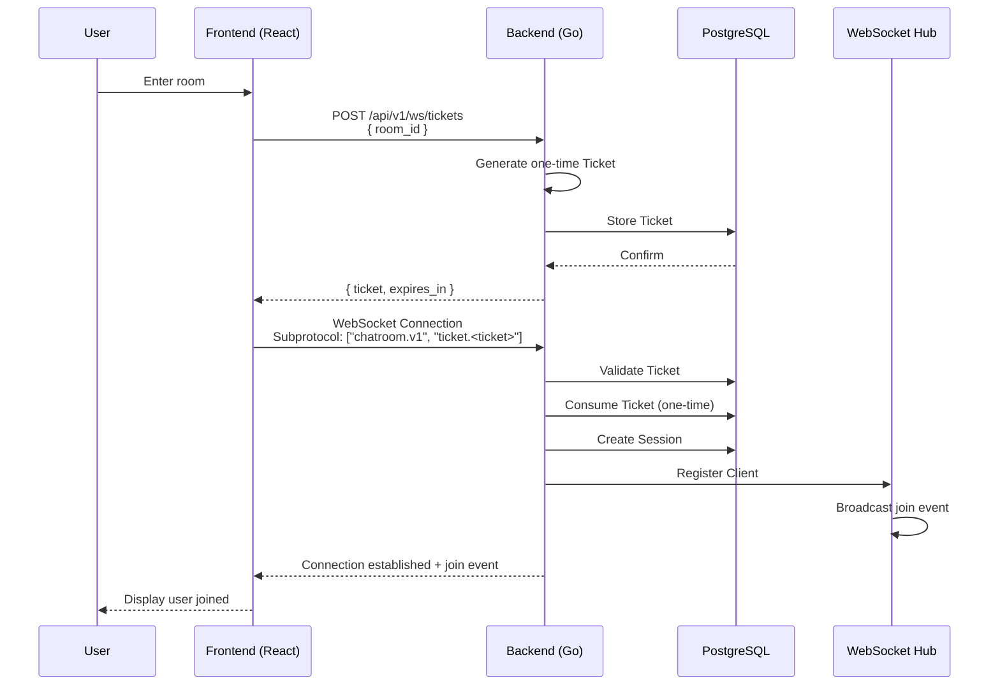
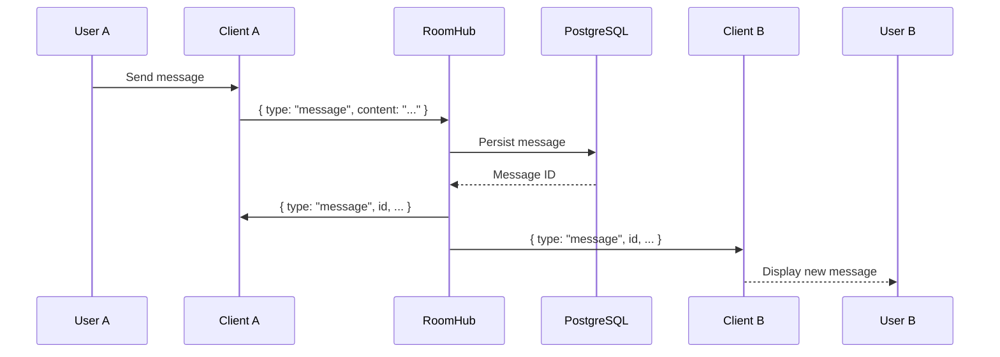
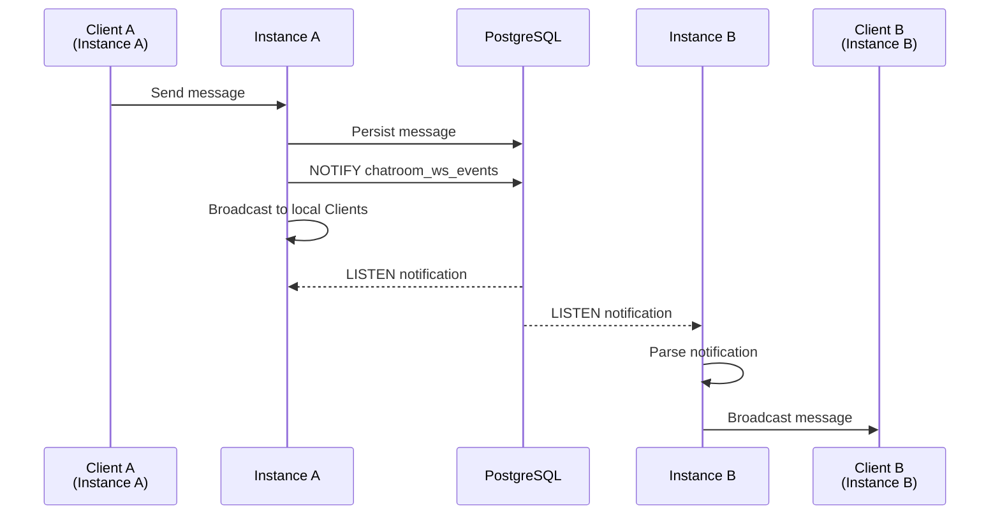
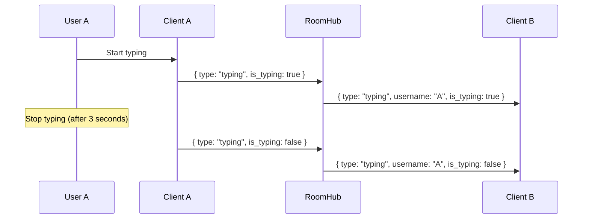

# Data Flow

This document analyzes the flow paths of key data in ChatRoom.

## Authentication Flow

## Token Refresh Flow

## WebSocket Connection Flow

## Message Flow

## Distributed Message Synchronization

## Typing Status Flow

---

🌐 **Languages**: English | [简体中文](/en/architecture/data-flow)
