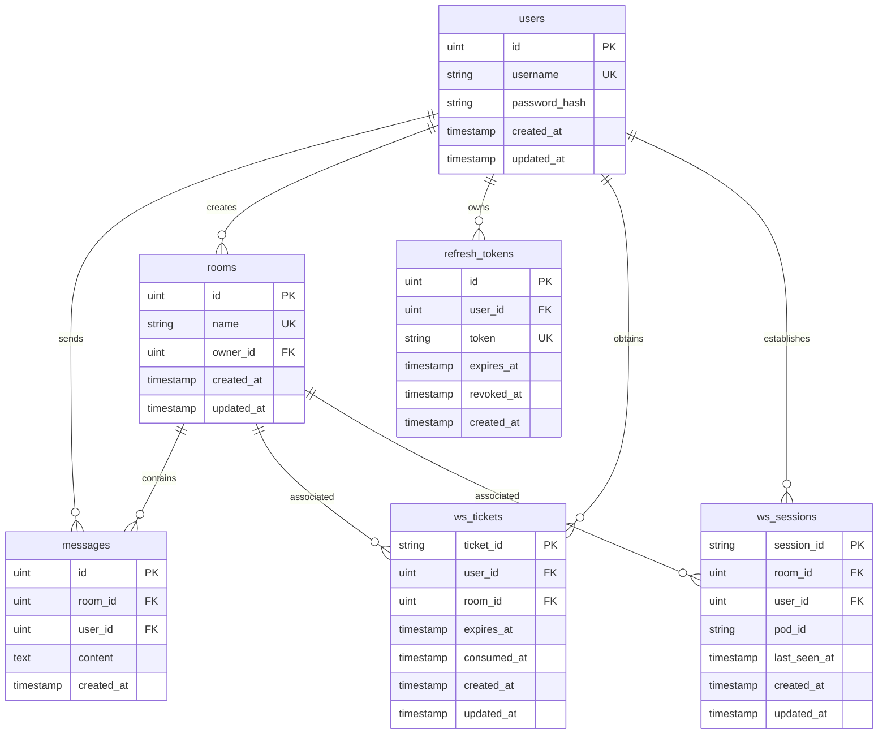

# Data Model

This document describes the database design of ChatRoom.

## ER Diagram

## Table Descriptions

| Table | Purpose | Key Indexes |
|-------|---------|-------------|
| `users` | User accounts | username (unique) |
| `rooms` | Chat rooms | name (unique), owner_id |
| `messages` | Chat messages | room_id, user_id, created_at |
| `refresh_tokens` | Refresh tokens | user_id, token (unique), expires_at |
| `ws_tickets` | WebSocket authentication tickets | user_id, room_id, expires_at |
| `ws_sessions` | WebSocket sessions (distributed online count) | room_id, user_id, pod_id |

## Detailed Field Descriptions

### users Table

| Field | Type | Constraint | Description |
|-------|------|------------|-------------|
| id | SERIAL | PRIMARY KEY | Auto-increment primary key |
| username | VARCHAR(64) | UNIQUE, NOT NULL | Username, unique |
| password_hash | VARCHAR(256) | NOT NULL | bcrypt hashed password |
| created_at | TIMESTAMP | NOT NULL | Creation time |
| updated_at | TIMESTAMP | NOT NULL | Update time |

### rooms Table

| Field | Type | Constraint | Description |
|-------|------|------------|-------------|
| id | SERIAL | PRIMARY KEY | Auto-increment primary key |
| name | VARCHAR(128) | UNIQUE, NOT NULL | Room name, unique |
| owner_id | INTEGER | FOREIGN KEY | Creator ID |
| created_at | TIMESTAMP | NOT NULL | Creation time |
| updated_at | TIMESTAMP | NOT NULL | Update time |

### messages Table

| Field | Type | Constraint | Description |
|-------|------|------------|-------------|
| id | SERIAL | PRIMARY KEY | Auto-increment primary key |
| room_id | INTEGER | FOREIGN KEY, NOT NULL | Room ID |
| user_id | INTEGER | FOREIGN KEY, NOT NULL | Sender ID |
| content | TEXT | NOT NULL | Message content, max 2000 characters |
| created_at | TIMESTAMP | NOT NULL | Creation time |

### refresh_tokens Table

| Field | Type | Constraint | Description |
|-------|------|------------|-------------|
| id | SERIAL | PRIMARY KEY | Auto-increment primary key |
| user_id | INTEGER | FOREIGN KEY, NOT NULL | User ID |
| token | VARCHAR(64) | UNIQUE, NOT NULL | Randomly generated token |
| expires_at | TIMESTAMP | NOT NULL | Expiration time |
| revoked_at | TIMESTAMP | | Revocation time (set during Token Rotation) |
| created_at | TIMESTAMP | NOT NULL | Creation time |

### ws_tickets Table

| Field | Type | Constraint | Description |
|-------|------|------------|-------------|
| ticket_id | VARCHAR(64) | PRIMARY KEY | Randomly generated ticket ID |
| user_id | INTEGER | FOREIGN KEY, NOT NULL | User ID |
| room_id | INTEGER | FOREIGN KEY, NOT NULL | Target room ID |
| expires_at | TIMESTAMP | NOT NULL | Expiration time (default 60 seconds) |
| consumed_at | TIMESTAMP | | Consumption time (set after use) |
| created_at | TIMESTAMP | NOT NULL | Creation time |
| updated_at | TIMESTAMP | NOT NULL | Update time |

### ws_sessions Table

| Field | Type | Constraint | Description |
|-------|------|------------|-------------|
| session_id | VARCHAR(64) | PRIMARY KEY | Session ID |
| room_id | INTEGER | FOREIGN KEY, NOT NULL | Room ID |
| user_id | INTEGER | FOREIGN KEY, NOT NULL | User ID |
| pod_id | VARCHAR(64) | NOT NULL | Instance identifier (distributed scenario) |
| last_seen_at | TIMESTAMP | NOT NULL | Last heartbeat time |
| created_at | TIMESTAMP | NOT NULL | Creation time |
| updated_at | TIMESTAMP | NOT NULL | Update time |

---

🌐 **Languages**: English | [简体中文](/zh/architecture/data-model)
