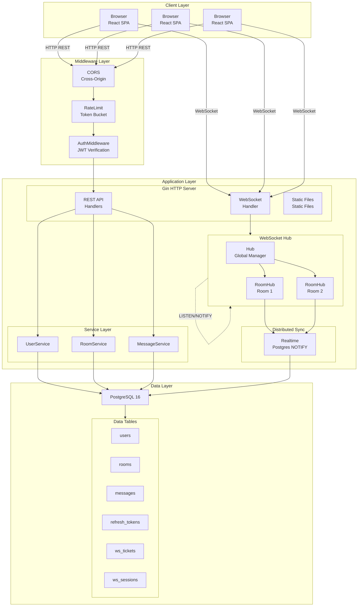
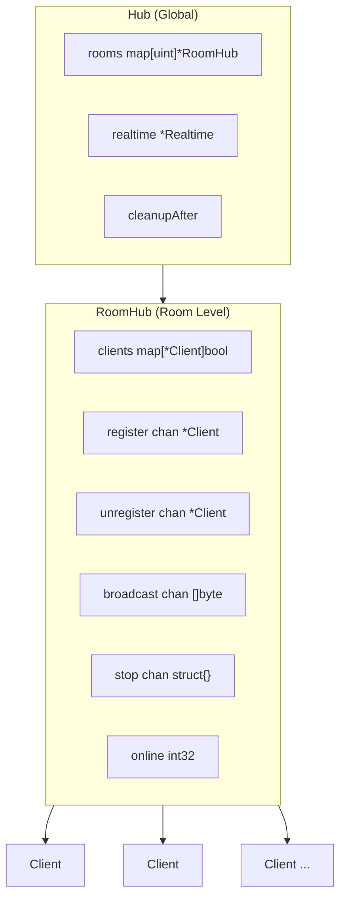
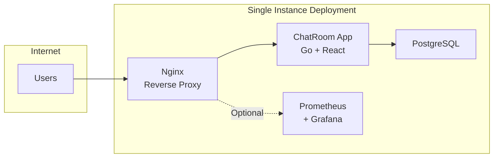
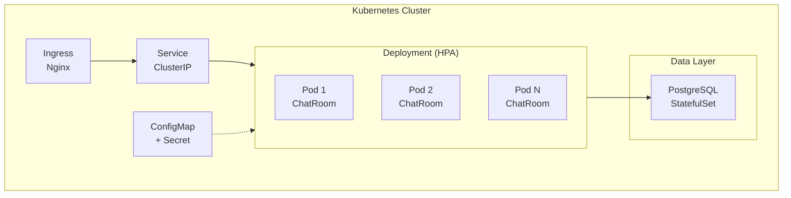

# System Architecture

## System Overview

ChatRoom is a real-time chatroom application with a frontend-backend separation architecture, supporting WebSocket real-time communication. The project is designed for educational purposes, emphasizing code readability and engineering best practices.

## Tech Stack

| Layer | Technology |
|-------|------------|
| Backend | Go 1.24, Gin, GORM, Gorilla WebSocket, zerolog |
| Frontend | React 19, TypeScript, Vite 7, Tailwind CSS v4 |
| Database | PostgreSQL 16 |
| Monitoring | Prometheus, Grafana |
| Deployment | Docker, Kubernetes |

## Directory Structure

```
chatroom/
├── cmd/server/              # Application entry point
│   └── main.go              # Startup, configuration, graceful shutdown
├── internal/                # Internal packages (not importable externally)
│   ├── auth/                # JWT, password hashing, token management
│   ├── config/              # Configuration loading and validation
│   ├── db/                  # Database connection, migration, cleanup
│   ├── log/                 # zerolog initialization
│   ├── metrics/             # Prometheus metrics
│   ├── models/              # GORM data models
│   ├── mw/                  # Gin middleware (auth, rate limiting, CORS)
│   ├── server/              # HTTP routing and handlers
│   ├── service/             # Business logic layer
│   └── ws/                  # WebSocket Hub, connections, distributed support
├── frontend/                # React main frontend
│   └── src/
│       ├── components/      # UI components
│       ├── hooks/           # Custom Hooks
│       ├── screens/         # Page components
│       └── *.ts             # API, Socket, Storage, etc.
├── web/                     # Static fallback UI
├── docs/                    # VitePress documentation site
├── deploy/                  # Deployment configuration
│   ├── docker/              # Dockerfile
│   ├── k8s/                 # Kubernetes manifests
│   └── prometheus/          # Prometheus configuration
└── openspec/                # Specs and active changes
```

## Overall Architecture



## Module Details

### cmd/server

Application entry point, responsibilities:

1. **Configuration Loading**: Call `config.Load()` to read configuration from environment variables
2. **Log Initialization**: Call `clog.Init()` to configure zerolog
3. **Configuration Validation**: Call `config.Validate()` to ensure required parameters are valid
4. **Database Connection**: Call `db.Connect()` to establish connection pool
5. **Database Migration**: Call `db.Migrate()` to auto-migrate table structures
6. **Start Cleanup Tasks**: Call `db.StartCleanup()` to periodically clean up expired data
7. **Create Hub**: Call `ws.NewHub()` to create WebSocket manager
8. **Build Routes**: Call `server.SetupRouter()` to create Gin engine
9. **Start HTTP Server**: Listen for requests in a separate goroutine
10. **Graceful Shutdown**: Catch signals, sequentially close Hub, cleanup tasks, HTTP server, database connection

### internal/config

Configuration management module:

```go
type Config struct {
    Port                  string   // HTTP listen port
    DatabaseDSN           string   // Database connection string
    JWTSecret             string   // JWT signing secret
    Env                   string   // Runtime environment (dev/staging/production)
    LogLevel              string   // Log level
    LogFormat             string   // Log format (console/json)
    AccessTokenTTLMinutes int      // Access Token validity period
    RefreshTokenTTLDays   int      // Refresh Token validity period
    WSTicketTTLSeconds    int      // WebSocket Ticket validity period
    AllowedOrigins        []string // CORS allowed origins list
    PodID                 string   // Instance identifier (distributed scenario)
}
```

### internal/auth

Authentication and authorization module:

| Function | Purpose |
|----------|---------|
| `HashPassword` | Hash password using bcrypt |
| `VerifyPassword` | Verify password matches hash |
| `GenerateAccessToken` | Issue JWT Access Token |
| `ParseAccessToken` | Parse and validate JWT |
| `GenerateRefreshToken` | Generate random Refresh Token |
| `ValidateRefreshToken` | Validate Refresh Token validity |
| `RevokeRefreshToken` | Revoke Refresh Token |
| `GenerateAndStoreWSTicket` | Generate and store WebSocket Ticket |
| `ValidateAndConsumeWSTicket` | Validate and consume WebSocket Ticket |

### internal/server

HTTP service layer:

```
Handler ──depends on──> Service Interface ──implemented by──> Service Struct ──depends on──> *gorm.DB
```

**Route Design**:

```
/health      GET  Health check
/healthz     GET  Health check (K8s compatible)
/ready       GET  Readiness check
/version     GET  Version information
/metrics     GET  Prometheus metrics

/api/v1/auth/register    POST   User registration
/api/v1/auth/login       POST   User login
/api/v1/auth/refresh     POST   Refresh token

/api/v1/rooms            GET    Room list
/api/v1/rooms            POST   Create room
/api/v1/rooms/:id/messages  GET Get messages

/api/v1/ws/tickets       POST   Get WS Ticket

/ws                      GET    WebSocket connection
```

### internal/ws

WebSocket core module:

#### Hub Structure



### internal/metrics

Prometheus metrics:

| Metric | Type | Description |
|--------|------|-------------|
| `chat_ws_connections` | Gauge | Current WebSocket connection count |
| `chat_ws_messages_total` | Counter | Cumulative message count |
| `http_requests_total` | Counter | Total HTTP requests |
| `http_request_duration_seconds` | Histogram | Request latency distribution |

---

## Deployment Architecture

### Single Instance Deployment



### Kubernetes Deployment



---

## Security Design

### Authentication and Authorization

| Mechanism | Description |
|-----------|-------------|
| JWT Access Token | Short-lived (default 15 minutes), used for API authentication |
| Refresh Token | Long-lived (default 7 days), stored in database, supports rotation |
| WebSocket Ticket | One-time ticket (default 60 seconds validity), prevents token leak |

### Protection Measures

| Measure | Implementation Location |
|---------|------------------------|
| Password Hashing | bcrypt, cost=10 |
| Rate Limiting | IP + path dimension, token bucket algorithm |
| CORS Validation | Strict origin whitelist |
| Input Validation | All request parameters validated |
| Message Length Limit | Single message max 2000 characters |
| WebSocket Message Size Limit | Max 1 MB |

---

🌐 **Languages**: English | [简体中文](/en/architecture/system)
