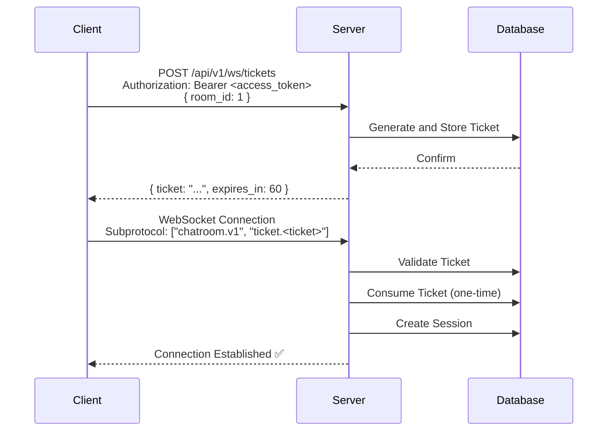

# ADR-001: WebSocket Authentication Scheme Selection

- **Status**: ✅ Adopted
- **Date**: 2025-01-15
- **Decision Makers**: @LessUp

## Background

WebSocket connections require authentication, but have the following technical limitations:

1. **WebSocket Handshake Doesn't Support Custom Headers**: Browser WebSocket API doesn't allow setting `Authorization` header during handshake
2. **Browser API Limitations**: `new WebSocket(url)` doesn't provide a way to set custom request headers
3. **Security Requirements**: Need to prevent token leaks and replay attacks

This means traditional Bearer Token authentication cannot be directly applied to WebSocket connections.

## Decision

Adopt a **One-time Ticket Authentication Scheme**:

1. Client first obtains a one-time ticket through REST API
2. Client passes the ticket via Subprotocol during WebSocket handshake
3. Server validates the ticket and immediately consumes it (one-time use)



### Ticket Design

| Attribute | Value | Description |
|-----------|-------|-------------|
| Validity | 60 seconds | Short validity, prevent replay |
| Usage Count | 1 time | One-time consumption |
| Binding | Specific room_id | Prevent cross-room abuse |
| Transmission Method | WebSocket Subprotocol | Not exposed in URL |

## Consequences

### ✅ Positive

- **High Security**: Ticket doesn't appear in URL, won't leak to server logs, proxy logs, browser history
- **Replay Attack Prevention**: One-time use + short validity period
- **Seamless Integration**: Integrates with existing JWT system, no additional authentication mechanism needed
- **Standards Compliant**: Uses WebSocket Subprotocol transmission, complies with RFC 6455

### ⚠️ Negative

- **Extra Request**: Each WebSocket connection requires one HTTP request to obtain ticket
- **Lifecycle Management**: Need to manage ticket expiration cleanup (implemented via `db.StartCleanup()`)
- **Distributed Complexity**: Multi-instance scenarios require shared ticket storage (solved via PostgreSQL database)

## Alternatives

### ❌ URL Parameter Token Transmission

```
ws://host/ws?token=<jwt>
```

**Rejection Reason**:
- JWT would appear in URL
- URL is recorded in server access logs, proxy logs, browser history, Referrer header
- Token may be intercepted by man-in-the-middle
- Violates security best practices

### ❌ Cookie Authentication

```javascript
// Rely on browser automatically sending cookies
const ws = new WebSocket('ws://host/ws');
```

**Rejection Reason**:
- Not suitable for SPA architecture, frontend uses localStorage not cookies
- Complex cookie handling for cross-domain WebSocket connections
- CSRF risk exists
- Poor mobile and non-browser client support

### ❌ Subprotocol Direct JWT Transmission

```javascript
const ws = new WebSocket(url, ['chatroom.v1', `token.<jwt>`]);
```

**Rejection Reason**:
- JWT has relatively long validity (15 minutes), can be replayed
- JWT doesn't support one-time consumption mechanism
- If JWT is leaked, attack window is larger
- Cannot bind to specific room

---

🌐 **Languages**: English | [简体中文](/en/decisions/001-ws-auth)
