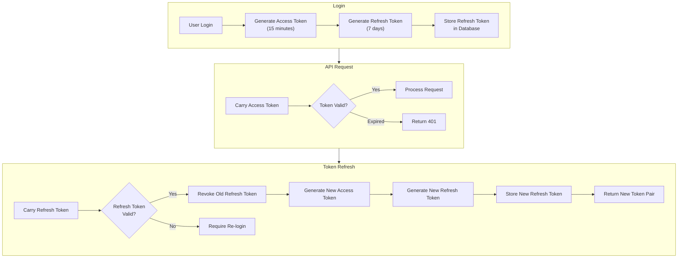

# ADR-002: Token Rotation Strategy

- **Status**: ✅ Adopted
- **Date**: 2025-01-20
- **Decision Makers**: @LessUp

## Background

User authentication requires tokens to verify identity. Traditional single-token approaches have the following issues:

1. **Long-term Token Risk**: If a token is leaked, an attacker can impersonate the user for the token's validity period
2. **Short-term Token UX**: Frequent re-login affects user experience
3. **Security vs Convenience Balance**: Need to find a balance between security and user experience

## Decision

Adopt a **Dual Token + Token Rotation Strategy**:



### Token Design

| Token Type | Validity | Storage Location | Purpose |
|------------|----------|------------------|---------|
| Access Token | 15 minutes | Frontend memory / localStorage | API request authentication |
| Refresh Token | 7 days | Database + Frontend localStorage | Refresh Access Token |

### Token Rotation Process

Each refresh will:
1. Validate the Refresh Token's validity
2. **Revoke** the old Refresh Token
3. Issue a **new** Access Token + Refresh Token pair

## Consequences

### ✅ Positive

- **Minimized Leak Window**: Access Token is short-lived, even if leaked, only 15 minutes of risk window
- **Seamless Refresh**: Users don't need to login frequently, Refresh Token automatically gets new Access Token
- **Traceability**: Refresh Token stored in database, can be audited and revoked
- **Auto Cleanup**: Expired Refresh Tokens are cleaned up by scheduled tasks

### ⚠️ Negative

- **Increased Complexity**: Need to manage lifecycles of two types of tokens
- **Database Dependency**: Refresh Token requires database storage, increases database load
- **Concurrent Refresh**: Multiple concurrent refreshes may cause token invalidation, requires client retry mechanism

## Alternatives

### ❌ Single Long-term Token

```
Token validity: 7 days
```

**Rejection Reason**:
- After token leak, attacker has 7 days to impersonate user
- Cannot actively revoke (unless introducing blacklist)
- Does not comply with OAuth 2.0 security best practices

### ❌ Single Short-term Token

```
Token validity: 15 minutes
No Refresh Token
```

**Rejection Reason**:
- Users need to re-login every 15 minutes
- Severely affects user experience
- Frequent login increases server load

### ❌ Session-based Authentication

```
Server-side Session + Cookie
```

**Rejection Reason**:
- Requires server-side storage of Session state
- Distributed scenarios require Session sharing (Redis, etc.)
- Not suitable for SPA and mobile architecture
- Cross-domain Cookie handling is complex

## Configuration Parameters

| Environment Variable | Default | Description |
|---------------------|---------|-------------|
| `ACCESS_TOKEN_TTL_MINUTES` | 15 | Access Token validity period (minutes) |
| `REFRESH_TOKEN_TTL_DAYS` | 7 | Refresh Token validity period (days) |

---

🌐 **Languages**: English | [简体中文](/en/decisions/002-token-rotation)
