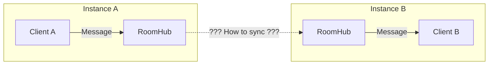
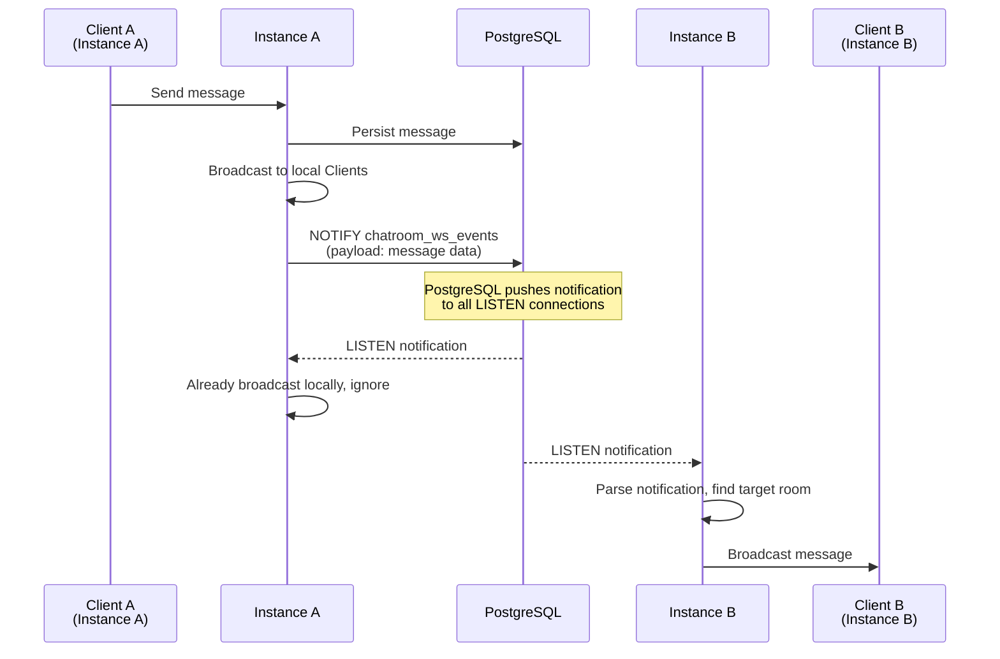
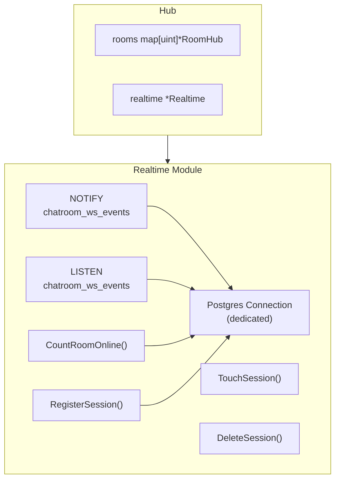

# ADR-003: Distributed Message Synchronization Scheme

- **Status**: ✅ Adopted
- **Date**: 2025-02-01
- **Decision Makers**: @LessUp

## Background

When ChatRoom is deployed as multiple instances, WebSocket connections are distributed across different instances. A message sent by User A connected to instance 1 needs to reach User B connected to instance 2. This requires a cross-instance message synchronization mechanism.



## Decision

Adopt **PostgreSQL LISTEN/NOTIFY** for cross-instance message broadcast:



### Architecture Design



### Session Management

Distributed online status tracking via `ws_sessions` table:

| Operation | Description |
|-----------|-------------|
| `RegisterSession` | Register session when connection established |
| `TouchSession` | Update last active time on heartbeat |
| `DeleteSession` | Delete session on disconnect |
| `CountRoomOnline` | Aggregate online count across all instances |

## Consequences

### ✅ Positive

- **Zero Extra Dependencies**: No need for Redis, Kafka, or other message middleware
- **Simple Architecture**: Leverages existing PostgreSQL, low operational cost
- **Low Latency**: Postgres NOTIFY is instant (millisecond level)
- **Transaction Consistency**: Message persistence and notification in the same transaction
- **Auto Reconnect**: Postgres driver supports auto-reconnect after LISTEN connection drops

### ⚠️ Negative

- **Notification Size Limit**: Postgres NOTIFY payload max 8000 bytes
- **No Delivery Guarantee**: LISTEN/NOTIFY is best-effort, notifications may be lost if instance temporarily disconnects
- **Single Database Dependency**: All instances must connect to the same PostgreSQL
- **Not for High Throughput**: High message volume scenarios may need more specialized message queues
- **Polling Statistics**: Online count statistics require database query, not real-time precise

## Alternatives

### ❌ Redis Pub/Sub

```
Publisher → Redis → Subscribers
```

**Rejection Reason**:
- Introduces new infrastructure dependency
- Increases operational complexity (need to maintain Redis cluster)
- Too heavyweight for an educational project
- Messages not persistent, lost on Redis restart

**Suitable Scenario**: When message throughput exceeds Postgres NOTIFY capacity

### ❌ Kafka / RabbitMQ

```
Producer → Message Queue → Consumers
```

**Rejection Reason**:
- Seriously over-engineered, too heavy for a chatroom application
- Extremely high operational cost
- Increases team learning curve
- Significantly increases deployment complexity

**Suitable Scenario**: Enterprise-level large-scale distributed systems

### ❌ Database Polling

```
Query messages table every N seconds for new messages
```

**Rejection Reason**:
- Too high latency (depends on polling interval)
- High database load (frequent queries)
- Wastes resources (most queries return no new messages)

---

🌐 **Languages**: English | [简体中文](/zh/decisions/003-distributed-sync)
