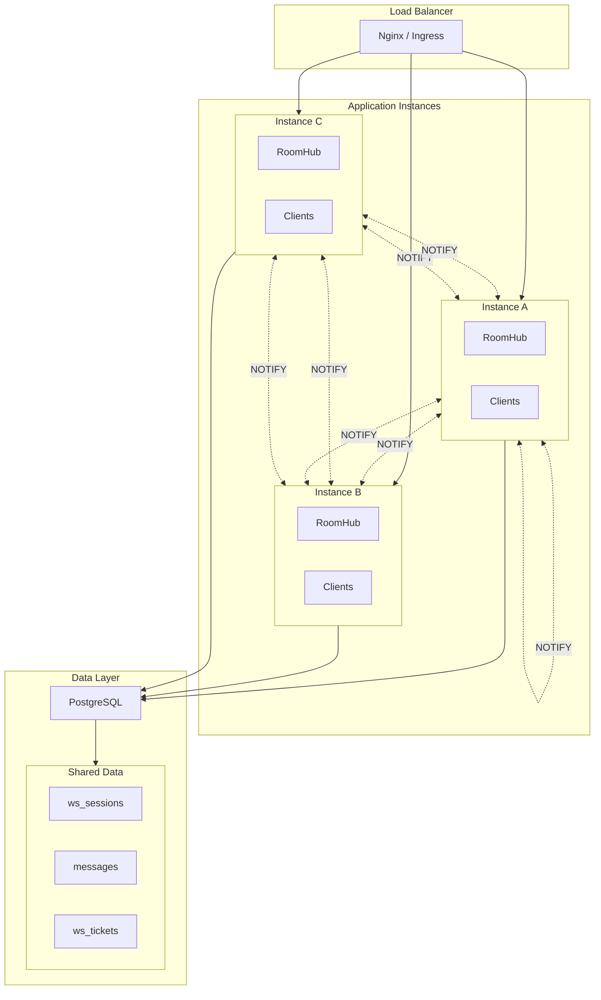
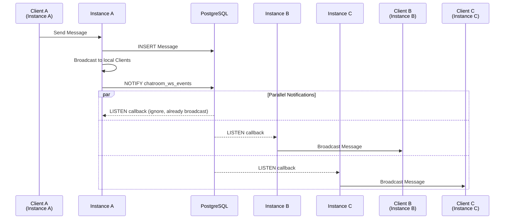
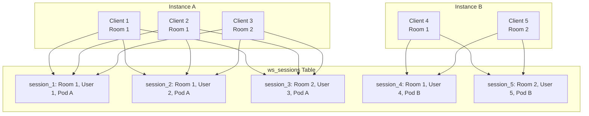

# Horizontal Scaling

This document describes ChatRoom's multi-instance deployment design and scaling strategies.

## Current Architecture



## Cross-Instance Message Synchronization

### How It Works

Each application instance:
1. **LISTEN** to PostgreSQL's `chatroom_ws_events` channel
2. When sending a message, **NOTIFY** all other instances
3. When receiving a notification, find local RoomHub and broadcast



### Notification Payload Format

```json
{
  "room_id": 1,
  "data": {
    "type": "message",
    "id": 123,
    "content": "Hello!",
    "username": "alice"
  }
}
```

## Distributed Online Status

### Session Management



### Online User Count Query

```sql
-- Query online user count for Room 1 (aggregated across all instances)
SELECT COUNT(DISTINCT user_id) 
FROM ws_sessions 
WHERE room_id = 1 
  AND last_seen_at > NOW() - INTERVAL '45 seconds';
```

## Load Balancing Strategy

### WebSocket Connection Routing

| Strategy | Description | Pros & Cons |
|----------|-------------|-------------|
| **Round Robin** | Rotate distribution | Simple, but may be uneven |
| **Least Connections** | Route to instance with fewest connections | Recommended, more even distribution |
| **Sticky Sessions** | Route same user to same instance | Reduces cross-instance communication, but limits failover |

### Recommendation: Least Connections

```
upstream chatroom {
    least_conn;
    server 10.0.0.1:8080;
    server 10.0.0.2:8080;
    server 10.0.0.3:8080;
}
```

## Extension Points

### Currently Implemented

1. **PostgreSQL NOTIFY**: Cross-instance message broadcast
2. **ws_sessions Table**: Distributed online status
3. **Stateless API**: All instances share the same database
4. **PodID Identifier**: Each instance has unique identifier

### Future Extensions

| Extension Direction | Implementation Approach | Complexity |
|---------------------|------------------------|------------|
| Redis Pub/Sub | Replace Postgres NOTIFY, higher throughput | Medium |
| Message Persistence | Kafka for message stream | High |
| Private Rooms | Add visibility field to rooms table | Low |
| Message Search | Elasticsearch full-text indexing | Medium |
| File Upload | Object storage + presigned URLs | Medium |
| End-to-End Encryption | Signal Protocol | Very High |

---

🌐 **Languages**: English | [简体中文](/en/deep-dives/scalability/horizontal)
