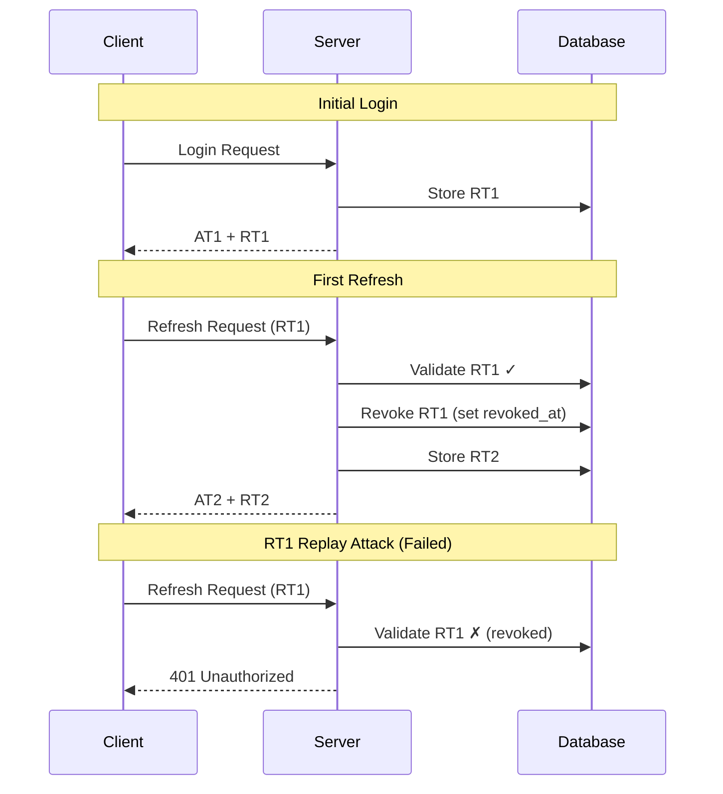
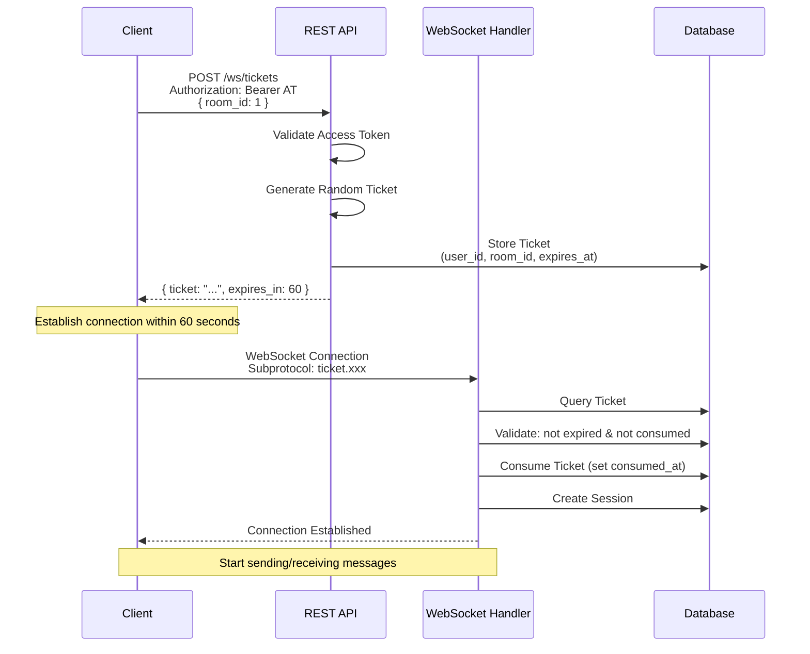

# Authentication Deep Dive

This document provides an in-depth analysis of ChatRoom's authentication implementation details.

## JWT Structure

### Access Token

```json
{
  "header": {
    "alg": "HS256",
    "typ": "JWT"
  },
  "payload": {
    "sub": "1",
    "username": "alice",
    "exp": 1704705600,
    "iat": 1704704700
  },
  "signature": "..."
}
```

| Field | Description |
|-------|-------------|
| `sub` | User ID |
| `username` | Username (avoid database lookup each time) |
| `exp` | Expiration time (15 minutes) |
| `iat` | Issued at time |

### Refresh Token

Randomly generated 64-byte hexadecimal string, stored in database:

```sql
SELECT * FROM refresh_tokens WHERE token = '...';
```

## Authentication Flow

### Complete Authentication Flow

```mermaid
flowchart TB
    subgraph Login["Login"]
        L1["User Input"] --> L2["POST /auth/login"]
        L2 --> L3["Query User"]
        L3 --> L4["bcrypt Verify Password"]
        L4 --> L5["Generate Access Token"]
        L5 --> L6["Generate Refresh Token"]
        L6 --> L7["Store Refresh Token"]
        L7 --> L8["Return Token Pair"]
    end
    
    subgraph API["API Request"]
        A1["Carry Access Token"] --> A2["AuthMiddleware"]
        A2 --> A3["Parse JWT"]
        A3 --> A4{"Verify Signature & Expiry"}
        A4 -->|Valid| A5["Inject User Info"]
        A4 -->|Expired| A6["Return 401"]
        A5 --> A7["Continue Processing Request"]
    end
    
    subgraph Refresh["Token Refresh"]
        R1["Carry Refresh Token"] --> R2["Query Database"]
        R2 --> R3{"Validate"}
        R3 -->|Valid| R4["Revoke Old Token"]
        R4 --> R5["Generate New Token Pair"]
        R5 --> R6["Store New Refresh Token"]
        R3 -->|Invalid| R7["Return 401"]
    end
```



### Token Rotation Details



## WebSocket Ticket Flow

### Why Need Ticket?

WebSocket handshake cannot carry Authorization Header, requires alternative authentication method.

### Ticket Lifecycle



### Ticket Security Features

| Feature | Implementation | Protection Target |
|---------|----------------|-------------------|
| One-time use | `consumed_at` field | Replay attack |
| Short validity | 60 seconds | Token leak |
| Room binding | `room_id` field | Cross-room abuse |
| User binding | `user_id` field | Identity spoofing |
| Not exposed in URL | Subprotocol transmission | Log leak |

## Password Security

### bcrypt Hashing

```go
// Hash password
hash, _ := bcrypt.GenerateFromPassword([]byte(password), bcrypt.DefaultCost)

// Verify password
err := bcrypt.CompareHashAndPassword([]byte(hash), []byte(password))
```

| Parameter | Value | Description |
|-----------|-------|-------------|
| Cost | 10 (default) | 2^10 = 1024 iterations |
| Output Length | 60 characters | Fixed length hash |
| Includes Salt | Yes | Prevents rainbow table attacks |

### Why Not Other Algorithms?

| Algorithm | Description |
|-----------|-------------|
| MD5/SHA1 | Already broken, not secure |
| SHA256/SHA512 | Requires separate salt, error-prone |
| Argon2 | More secure, but bcrypt is sufficient |
| PBKDF2 | Similar to bcrypt, but more complex implementation |

---

🌐 **Languages**: English | [简体中文](/zh/deep-dives/security/auth-deep-dive)
