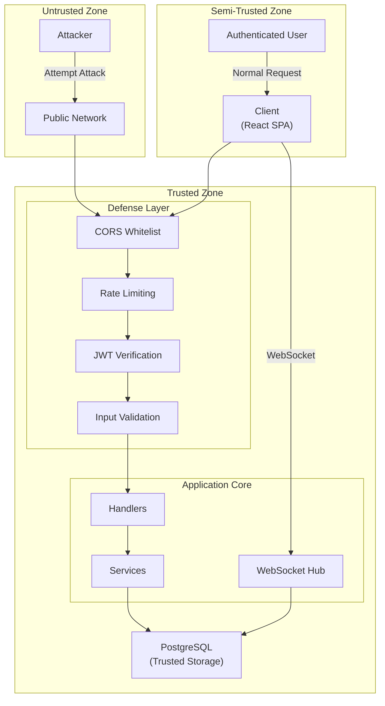

# Threat Model

This document analyzes ChatRoom's security threat model and mitigation measures.

## Trust Boundaries

## Threat Analysis

### STRIDE Threat Classification

| Threat Type | Threat Description | Mitigation Measures |
|-------------|-------------------|---------------------|
| **Spoofing** | Attacker impersonates legitimate user | JWT authentication + Token Rotation |
| **Tampering** | Modifying data in transit | HTTPS + JWT signature verification |
| **Repudiation** | User denies performing an action | Audit logs + message persistence |
| **Information Disclosure** | Sensitive data leakage | Password hashing + short token validity |
| **Denial of Service** | Making service unavailable | Rate limiting + connection limits |
| **Elevation of Privilege** | Gaining unauthorized permissions | Strict permission checks |

## Threats and Mitigation Details

### Password Leak

| Attribute | Value |
|-----------|-------|
| Risk Level | High |
| Threat | Database leak exposes user passwords |
| Mitigation | bcrypt hashing (cost=10), irreversible |
| Residual Risk | Brute force on weak passwords |

### Token Leak

| Attribute | Value |
|-----------|-------|
| Risk Level | High |
| Threat | Access Token intercepted |
| Mitigation | Short validity (15 minutes) + HTTPS |
| Residual Risk | Impersonation attack within 15 minutes |

### Refresh Token Leak

| Attribute | Value |
|-----------|-------|
| Risk Level | High |
| Threat | Refresh Token intercepted |
| Mitigation | Token Rotation (revoke old token on each refresh) |
| Residual Risk | Race condition from concurrent refreshes |

### Replay Attack

| Attribute | Value |
|-----------|-------|
| Risk Level | Medium |
| Threat | Intercept and replay WebSocket Ticket |
| Mitigation | One-time consumption + 60 second validity |
| Residual Risk | Replay within 60 seconds |

### Brute Force

| Attribute | Value |
|-----------|-------|
| Risk Level | Medium |
| Threat | Brute force username/password combinations |
| Mitigation | Rate limiting (10 attempts/minute/IP) |
| Residual Risk | Distributed brute force |

### XSS (Cross-Site Scripting)

| Attribute | Value |
|-----------|-------|
| Risk Level | Medium |
| Threat | Inject malicious script execution |
| Mitigation | Input validation + React auto-escaping |
| Residual Risk | XSS in user-generated content |

### CSRF (Cross-Site Request Forgery)

| Attribute | Value |
|-----------|-------|
| Risk Level | Low |
| Threat | Cross-site forged request |
| Mitigation | Not using cookies + SameSite policy |
| Residual Risk | None |

### SQL Injection

| Attribute | Value |
|-----------|-------|
| Risk Level | Low |
| Threat | Inject malicious SQL statements |
| Mitigation | GORM parameterized queries |
| Residual Risk | None |

## OWASP Top 10 Checklist

| OWASP Risk | Status | Description |
|------------|--------|-------------|
| A01: Broken Access Control | ✅ | JWT verification + route permission checks |
| A02: Cryptographic Failures | ✅ | bcrypt + HTTPS |
| A03: Injection | ✅ | GORM parameterization + input validation |
| A04: Insecure Design | ✅ | Threat model driven design |
| A05: Security Misconfiguration | ⚠️ | Depends on production environment configuration |
| A06: Vulnerable Components | ⚠️ | Requires regular dependency audits |
| A07: Auth Failures | ✅ | Token Rotation + rate limiting |
| A08: Software & Data Integrity | ✅ | JWT signature verification |
| A09: Security Logging | ✅ | zerolog structured logging |
| A10: SSRF | N/A | No external requests involved |

## Production Security Checklist

- [ ] Use strong random key for JWT_SECRET (≥32 bytes)
- [ ] Enable HTTPS (TLS 1.2+)
- [ ] Database uses strong password, restrict network access
- [ ] Strict ALLOWED_ORIGINS configuration, don't use `*`
- [ ] Regularly update dependencies, fix known vulnerabilities
- [ ] Enable audit logging
- [ ] Configure monitoring alerts

---

🌐 **Languages**: English | [简体中文](/zh/deep-dives/security/threat-model)
