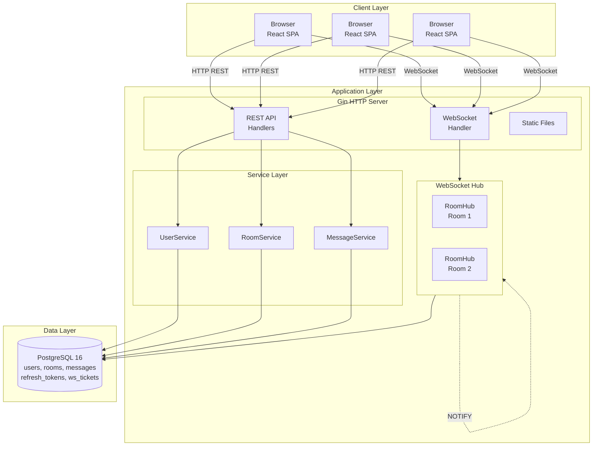

## Tech Stack

| Layer | Technology |
|-------|------------|
| Backend | Go 1.24, Gin, GORM, Gorilla WebSocket, zerolog |
| Frontend | React 19, TypeScript, Vite 7, Tailwind CSS v4 |
| Database | PostgreSQL 16 |
| Observability | Prometheus, Grafana |
| Delivery | Docker, Kubernetes, GitHub Actions |

## Architecture Preview

## Documentation Navigation

### Getting Started

- [Getting Started](/en/getting-started) - Run the full stack in minutes
- [Learning Path](/en/learning-path) - Step-by-step learning guide

### Architecture

- [System Architecture](/en/architecture/system) - Complete architecture breakdown
- [Data Flow](/en/architecture/data-flow) - Request and message flow
- [Data Model](/en/architecture/data-model) - Database design

### Design Decisions (ADR)

- [ADR-001: WebSocket Auth](/en/decisions/001-ws-auth) - Why the Ticket approach
- [ADR-002: Token Rotation](/en/decisions/002-token-rotation) - Dual-token design
- [ADR-003: Distributed Sync](/en/decisions/003-distributed-sync) - Postgres NOTIFY approach

### Deep Dives

- [Performance Benchmarks](/en/deep-dives/performance/benchmarks) - Throughput and latency data
- [Threat Model](/en/deep-dives/security/threat-model) - Security analysis and mitigations
- [Horizontal Scaling](/en/deep-dives/scalability/horizontal) - Multi-instance deployment design

### API Reference

- [REST API](/en/api/rest) - Complete API documentation
- [WebSocket Protocol](/en/api/websocket) - Real-time communication protocol
