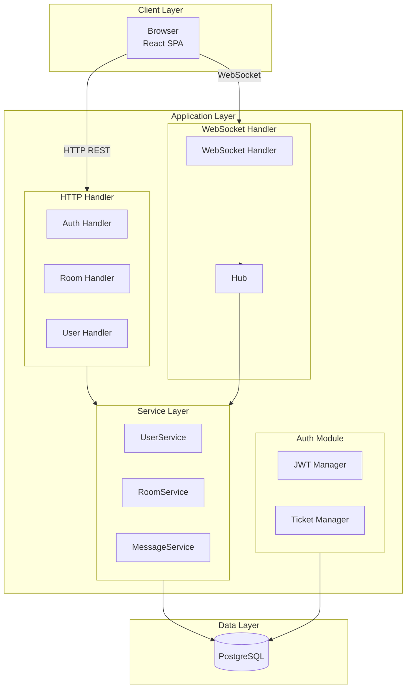
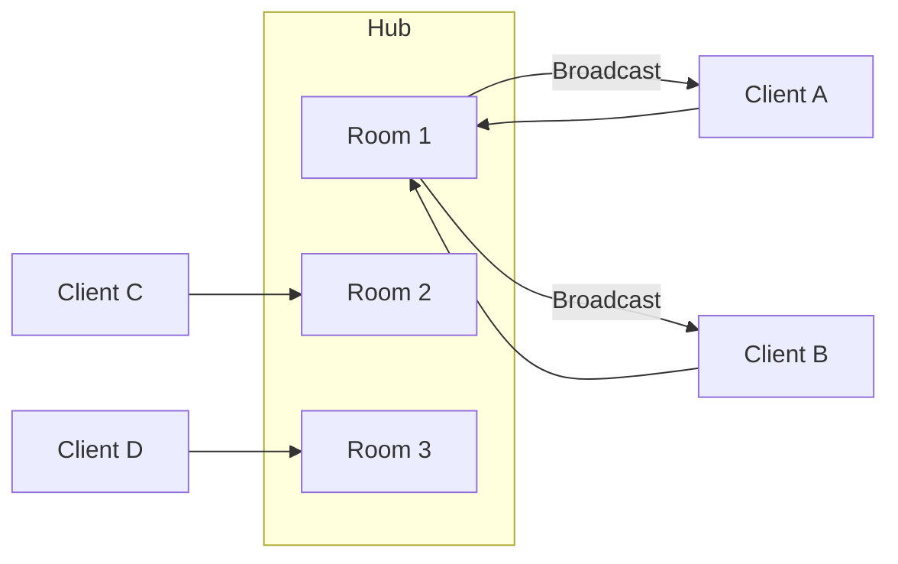
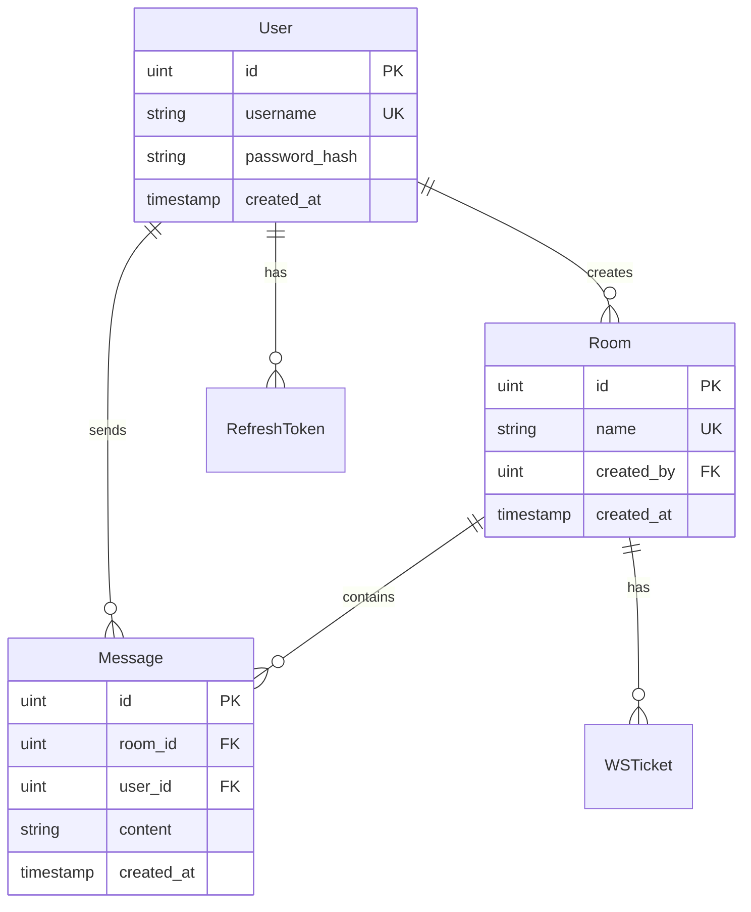
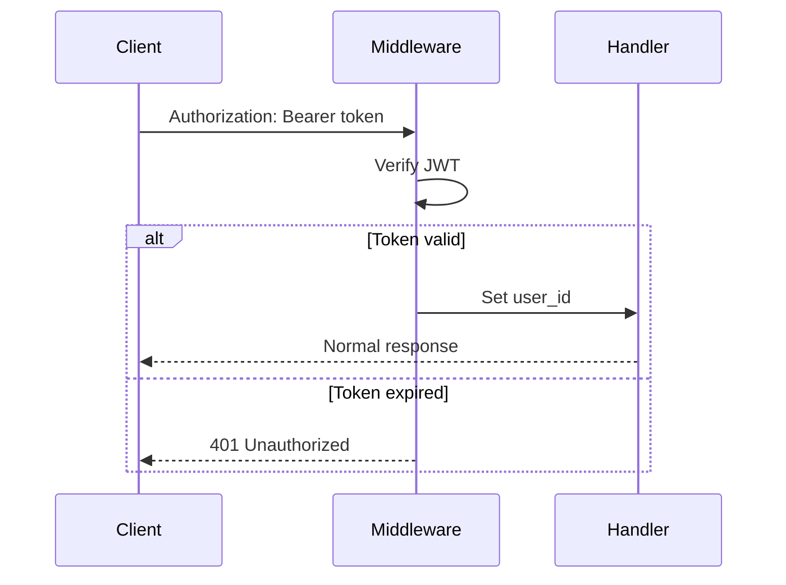
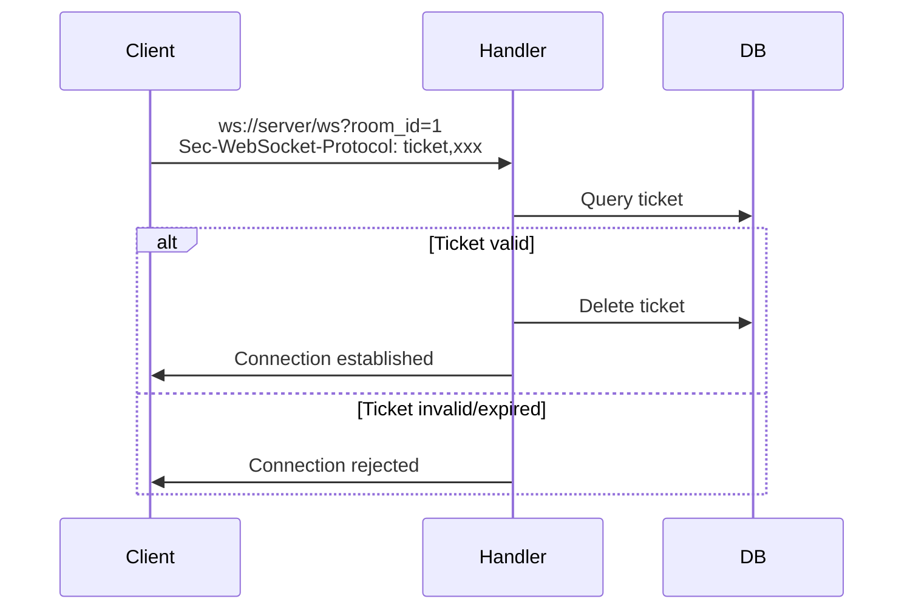

# Architecture

This document describes ChatRoom's technical architecture in detail.

## Three-Layer Architecture

## Core Components

### 1. HTTP Handler Layer

Responsibility: Request parsing, response formatting, basic validation

### 2. Service Layer

Responsibility: Business logic, transaction management, data access

### 3. WebSocket Hub

Responsibility: Connection management, message broadcasting

## Data Model

## Authentication Flow

### REST API Authentication

### WebSocket Authentication

---

Next: [Key Decisions](/en/whitepaper/decisions)

---

🌐 **Languages**: English | [简体中文](/zh/whitepaper/architecture)
