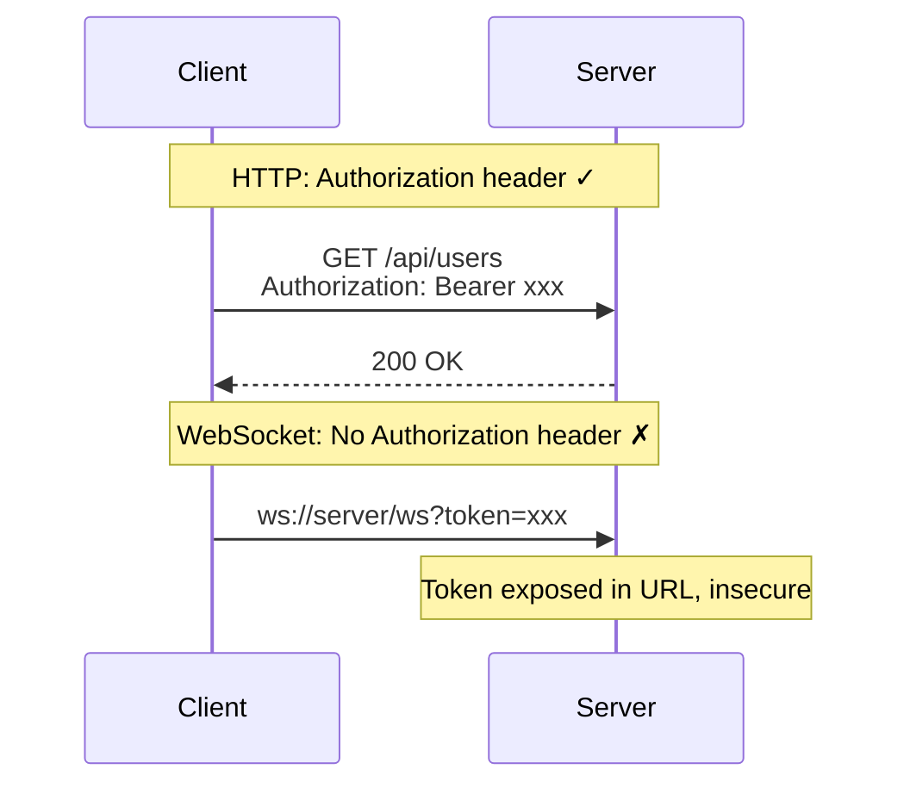

# Problem Statement

This document describes the core problems that ChatRoom aims to solve.

## Real-Time System Challenges

### 1. Connection State Management

WebSocket connections are **stateful**, in contrast to stateless REST APIs:

| REST API | WebSocket |
|----------|-----------|
| Stateless | Stateful |
| Independent requests | Persistent connection |
| Easy to scale | Scaling requires state migration |
| Simple load balancing | Requires sticky sessions or message sync |

**Core Question**: How to maintain message consistency across multiple instances?

### 2. Authentication & Authorization

WebSocket protocol **does not support standard HTTP Authorization headers**:



**Core Question**: How to securely authenticate WebSocket connections?

### 3. Token Security

Problems with traditional single-token approach:

```
Long-lived Access Token → High leak risk
Short-lived Access Token → Frequent re-login
```

**Core Question**: How to balance security and user experience?

### 4. Message Reliability

Real-time message challenges:

- **Ordering**: Are messages delivered in order?
- **Loss detection**: How to detect lost messages?
- **Reconnection recovery**: How to restore state after disconnect?

### 5. Horizontal Scaling

Single-instance limitations:

```
Single WebSocket instance → Limited connections
Multiple instances → How to sync messages?
```

**Core Question**: How to implement message sync without introducing Redis?

## Design Constraints

### Tech Stack Constraints

| Constraint | Reason |
|------------|--------|
| Go backend | Learning Go language |
| React frontend | Modern UI development practice |
| PostgreSQL | Single data source, reduced complexity |
| No Redis | Keep architecture simple |

### Teaching Constraints

- **Readability first**: No over-abstraction
- **Progressive complexity**: Simple to complex
- **Actually usable**: Not a toy project

## Problem Summary

| Problem | Difficulty | Solution |
|---------|-----------|----------|
| WebSocket Auth | Medium | Ticket approach |
| Token Security | Medium | Dual Token rotation |
| Message Sync | High | PostgreSQL NOTIFY |
| Horizontal Scaling | High | Architecture design |

---

Next: [Solution Overview](/en/whitepaper/solution)

---

🌐 **Languages**: English | [简体中文](/zh/whitepaper/problem)
