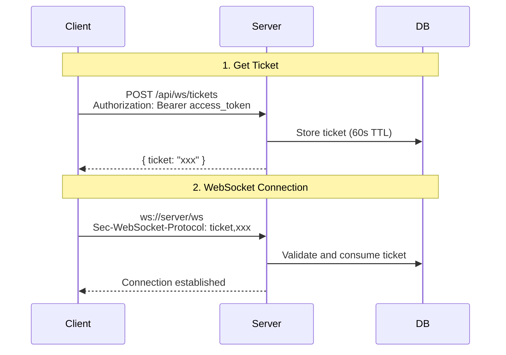

# Solution Overview

This document outlines ChatRoom's core design solutions and philosophy.

## Design Philosophy

### 1. Simplicity First

> "Perfection is achieved not when there is nothing more to add, but when there is nothing left to take away."

We choose:
- PostgreSQL over PostgreSQL + Redis
- Monolithic architecture over microservices
- Simple solutions over complex ones

### 2. Secure by Default

All design decisions prioritize security:

- Conservative default token TTLs
- Strict CORS validation by default
- Input sanitization by default

### 3. Observability Built-in

Monitoring is not added after the fact, but considered at design time:

- Every component exposes metrics
- Critical paths have logging
- Errors have clear error codes

## Core Solutions

### 1. JWT Dual Token Authentication

```
┌─────────────────────────────────────────────┐
│              Token Lifecycle                 │
├─────────────────────────────────────────────┤
│                                             │
│  Login ──→ Access Token (15min)             │
│        └──→ Refresh Token (7 days)          │
│                                             │
│  Access expires ──→ Use Refresh for new     │
│                 └──→ Refresh also rotates    │
│                                             │
│  Refresh expires ──→ Re-login               │
│                                             │
└─────────────────────────────────────────────┘
```

**Advantages**:
- Access Token leak impact is limited (15 min)
- Refresh Token rotation detects theft
- Transparent to users

### 2. WebSocket Ticket Authentication



**Advantages**:
- Token not exposed in URL
- Ticket is one-time use
- Bound to room, preventing abuse

### 3. PostgreSQL LISTEN/NOTIFY

```mermaid
flowchart LR
    subgraph Instance1["Instance 1"]
        WS1[WebSocket<br/>Conn A, B]
    end

    subgraph Instance2["Instance 2"]
        WS2[WebSocket<br/>Conn C, D]
    end

    subgraph PG[(PostgreSQL)]
        NOTIFY[NOTIFY<br/>channel: room:1]
        LISTEN[LISTEN<br/>channel: room:1]
    end

    WS1 -->|Message| NOTIFY
    NOTIFY -->|Broadcast| LISTEN
    LISTEN -->|Push| WS2
```

**Advantages**:
- No additional components (Redis)
- Transactional messaging (atomic with DB ops)
- Auto-cleanup (auto UNLISTEN on disconnect)

## Technology Choices

| Choice | Reason |
|--------|--------|
| Go | Simple concurrency model, suitable for WebSocket |
| Gin | High performance, mature ecosystem |
| GORM | ORM abstraction, reduces boilerplate |
| React | Component-based, concise Hooks |
| TypeScript | Type safety |
| Vite | Fast development experience |
| PostgreSQL | Feature-rich, LISTEN/NOTIFY support |

---

Next: [Architecture](/en/whitepaper/architecture)

---

🌐 **Languages**: English | [简体中文](/zh/whitepaper/solution)
