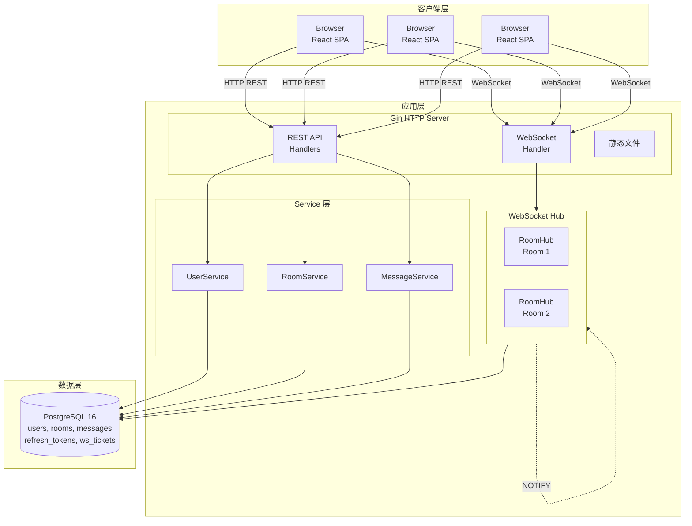

## 技术栈

| 层级 | 技术选型 |
|------|----------|
| 后端 | Go 1.24, Gin, GORM, Gorilla WebSocket, zerolog |
| 前端 | React 19, TypeScript, Vite 7, Tailwind CSS v4 |
| 数据库 | PostgreSQL 16 |
| 可观测性 | Prometheus, Grafana |
| 部署 | Docker, Kubernetes, GitHub Actions |

## 架构预览

## 文档导航

### 入门

- [快速开始](/getting-started) - 几分钟内启动完整系统
- [学习路径](/learning-path) - 循序渐进学习指南

### 架构深度

- [系统架构](/architecture/system) - 完整架构解析
- [数据流](/architecture/data-flow) - 请求与消息流转
- [数据模型](/architecture/data-model) - 数据库设计

### 设计决策 (ADR)

- [ADR-001: WebSocket 认证方案](/decisions/001-ws-auth) - 为什么选择 Ticket 方案
- [ADR-002: Token Rotation 策略](/decisions/002-token-rotation) - 双 Token 设计
- [ADR-003: 分布式消息同步](/decisions/003-distributed-sync) - Postgres NOTIFY 方案

### 技术深度

- [性能基准](/deep-dives/performance/benchmarks) - 吞吐量与延迟数据
- [威胁模型](/deep-dives/security/threat-model) - 安全分析与缓解措施
- [水平扩展](/deep-dives/scalability/horizontal) - 多实例部署设计

### API 参考

- [REST API](/api/rest) - 完整 API 文档
- [WebSocket 协议](/api/websocket) - 实时通信协议
