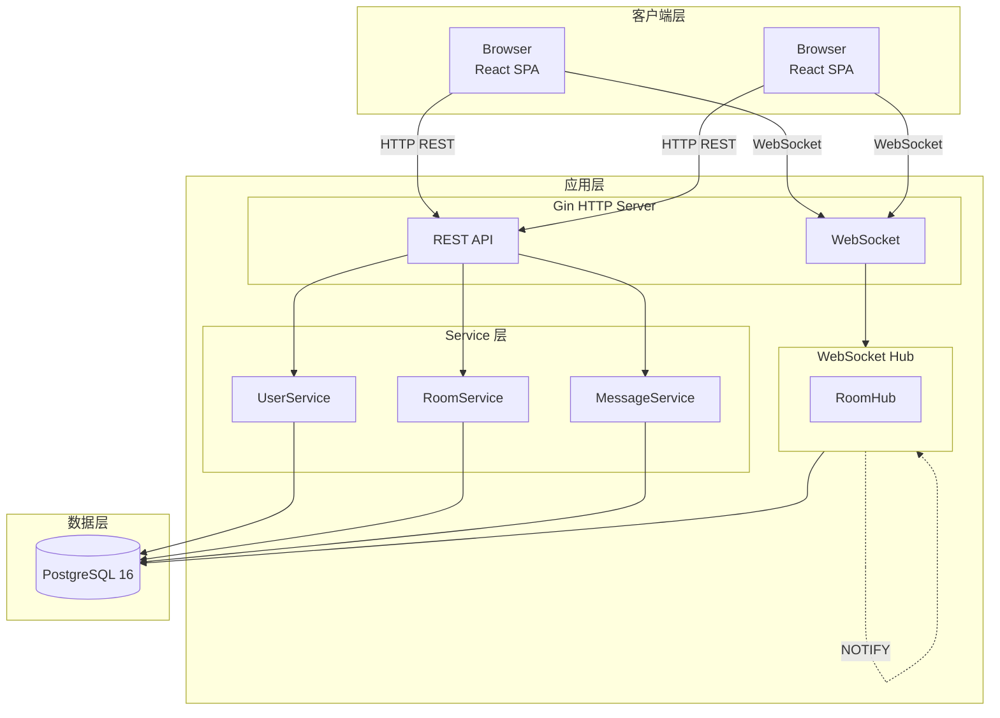

# ChatRoom 技术白皮书

> 实时全栈系统架构参考实现

  Go 1.24
  React 19
  WebSocket
  PostgreSQL

一个教学导向的实时聊天室，展示现代全栈系统的核心设计模式

## 核心特性

  

    <h3>🔐 JWT 双 Token 认证</h3>
    
短期 Access Token + 长期 Refresh Token，自动轮换机制有效降低泄露风险

  

  

    <h3>🎫 WebSocket Ticket 认证</h3>
    
一次性票据方案，通过 Subprotocol 传递，60秒有效期，防止重放攻击

  

  

    <h3>🌐 分布式消息同步</h3>
    
基于 PostgreSQL LISTEN/NOTIFY 的跨实例广播，无需 Redis，保持架构简洁

  

  

    <h3>📊 Prometheus 可观测性</h3>
    
内置连接数、吞吐量、延迟分布等指标，支持 Grafana 可视化

  

## 快速导航

  <a href="/zh/whitepaper/" class="nav-card primary">
    
📖

    
白皮书

    
完整技术方案解析

  </a>
  <a href="/zh/architecture/system" class="nav-card">
    
🏗️

    
架构概览

    
系统分层与组件交互

  </a>
  <a href="/zh/tutorials/local-dev" class="nav-card">
    
🚀

    
快速开始

    
几分钟内启动项目

  </a>

## 架构预览

