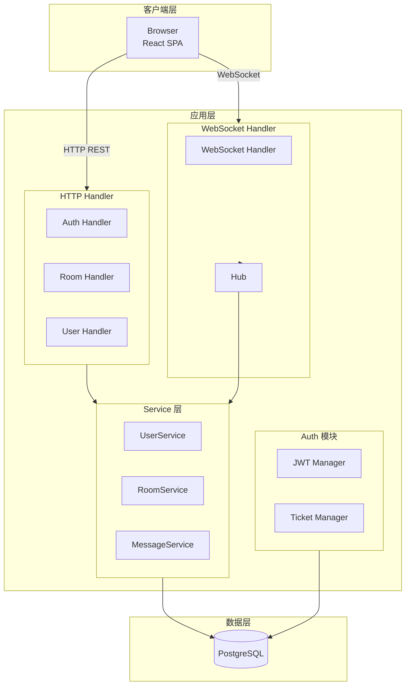
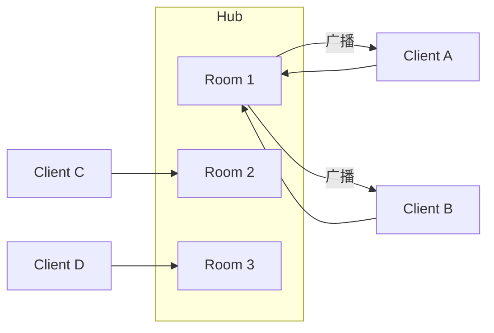
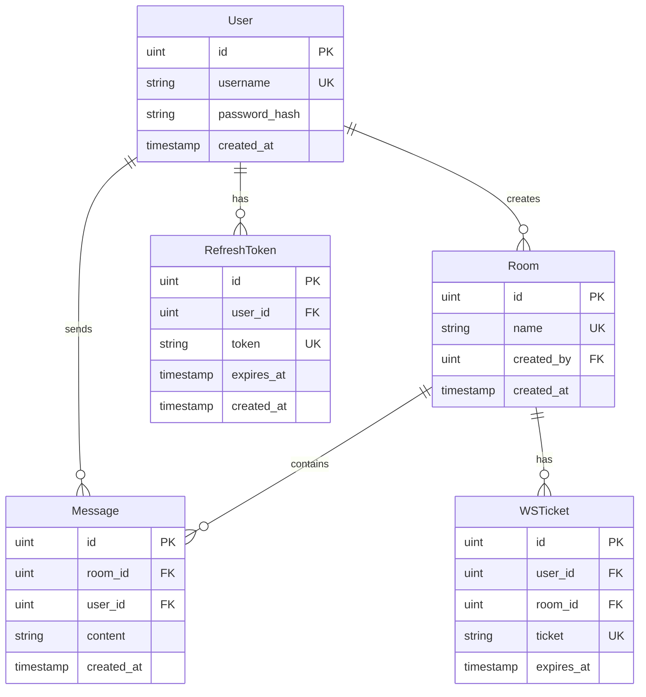
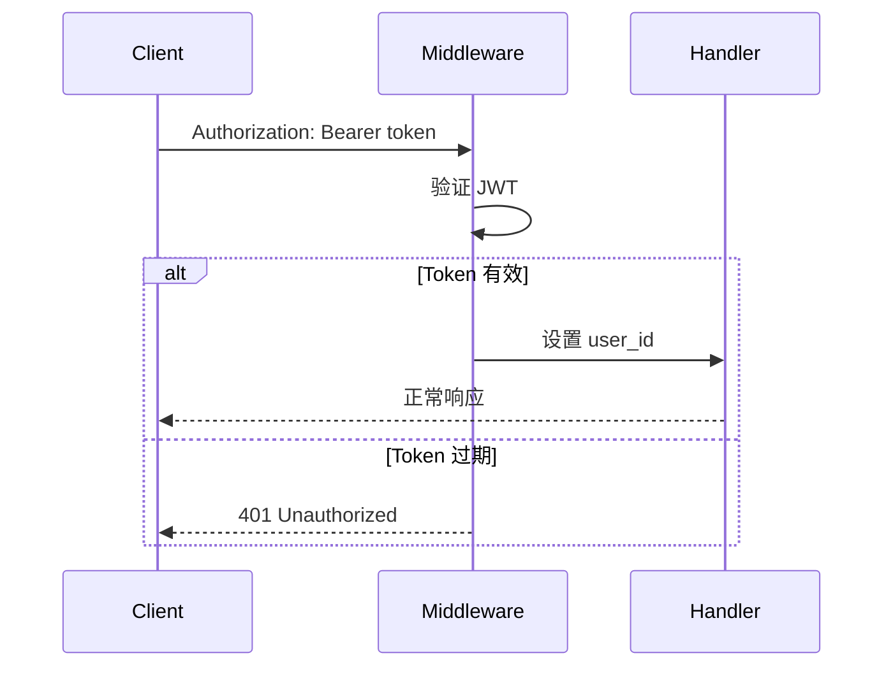
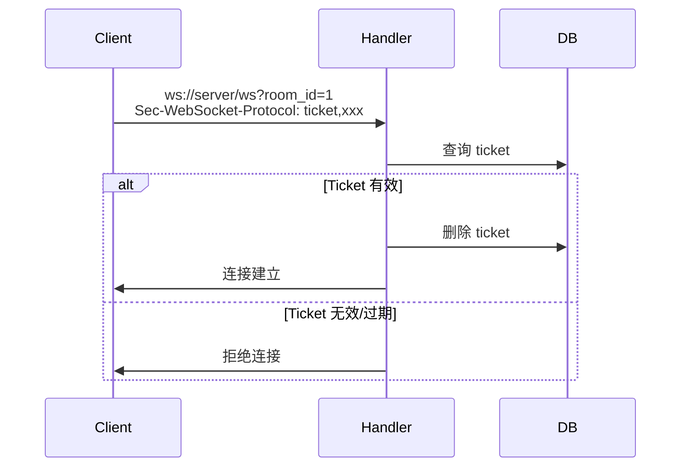

# 技术架构

本文档详细描述 ChatRoom 的技术架构。

## 三层架构



## 核心组件

### 1. HTTP Handler 层

职责：请求解析、响应格式化、基础验证

```go
// 典型 Handler 结构
func (h *Handler) CreateRoom(c *gin.Context) {
    // 1. 解析请求
    var req CreateRoomRequest
    if err := c.ShouldBindJSON(&req); err != nil {
        c.JSON(400, gin.H{"error": "invalid request"})
        return
    }

    // 2. 获取用户信息
    userID := c.GetUint("user_id")

    // 3. 调用服务层
    room, err := h.service.CreateRoom(c.Request.Context(), userID, req.Name)
    if err != nil {
        c.JSON(500, gin.H{"error": err.Error()})
        return
    }

    // 4. 返回响应
    c.JSON(201, room)
}
```

### 2. Service 层

职责：业务逻辑、事务管理、数据访问

```go
// 典型 Service 结构
func (s *Service) CreateRoom(ctx context.Context, userID uint, name string) (*Room, error) {
    // 1. 业务验证
    exists, _ := s.repo.RoomExistsByName(ctx, name)
    if exists {
        return nil, ErrRoomNameExists
    }

    // 2. 创建实体
    room := &Room{
        Name:      name,
        CreatedBy: userID,
    }

    // 3. 持久化
    if err := s.repo.CreateRoom(ctx, room); err != nil {
        return nil, err
    }

    return room, nil
}
```

### 3. WebSocket Hub

职责：连接管理、消息广播



## 数据模型



## 认证流程

### REST API 认证



### WebSocket 认证



## 请求流程

### 发送消息完整流程

```mermaid
sequenceDiagram
    participant Client
    participant WSHandler
    participant Hub
    participant Service
    participant DB
    participant PG[PostgreSQL<br/>NOTIFY]

    Client->>WSHandler: WebSocket 消息
    WSHandler->>WSHandler: 解析消息类型
    WSHandler->>Service: 保存消息
    Service->>DB: INSERT message
    DB-->>Service: message_id
    Service->>PG: NOTIFY room:1
    Service-->>WSHandler: 返回消息
    WSHandler->>Hub: 广播到房间
    Hub->>Client: 推送给所有客户端
```

## 错误处理

### 错误码设计

| 范围 | 类别 |
|------|------|
| 1000-1999 | 认证错误 |
| 2000-2999 | 业务错误 |
| 3000-3999 | 系统错误 |

### 示例响应

```json
{
  "error": "invalid_token",
  "code": 1001,
  "message": "Token 已过期，请刷新"
}
```

## 配置管理

### 环境变量

| 变量 | 默认值 | 说明 |
|------|--------|------|
| `APP_PORT` | 8080 | HTTP 端口 |
| `APP_ENV` | dev | 环境 |
| `DATABASE_DSN` | - | 数据库连接 |
| `JWT_SECRET` | dev-secret | JWT 密钥 |
| `ACCESS_TOKEN_TTL_MINUTES` | 15 | Access Token 有效期 |
| `REFRESH_TOKEN_TTL_DAYS` | 7 | Refresh Token 有效期 |

---

下一步：[关键决策](/zh/whitepaper/decisions)

---

🌐 **Languages**: [English](/en/whitepaper/architecture) | 简体中文
