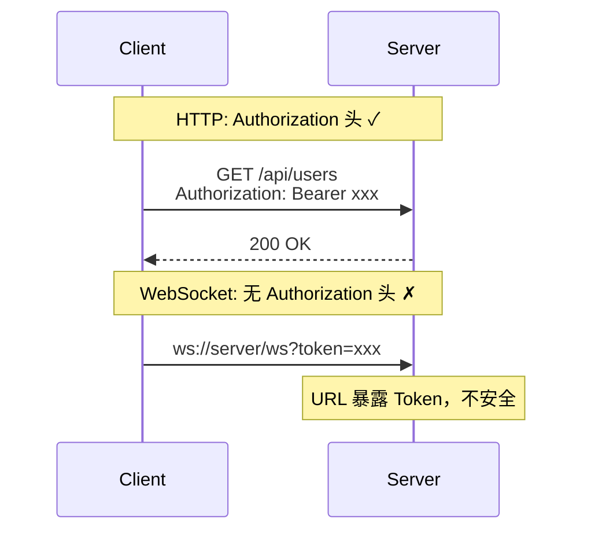

# 问题陈述

本文档阐述 ChatRoom 项目要解决的核心问题及其背景。

## 实时系统的挑战

### 1. 连接状态管理

WebSocket 连接是**有状态的**，这与无状态的 REST API 形成鲜明对比：

| REST API | WebSocket |
|----------|-----------|
| 无状态 | 有状态 |
| 每次请求独立 | 连接持续存在 |
| 易于扩展 | 扩展需要考虑状态迁移 |
| 负载均衡简单 | 需要粘性会话或消息同步 |

**核心问题**：如何在多实例部署时保持消息一致性？

### 2. 认证与授权

WebSocket 协议**不支持标准 HTTP Authorization 头**：



**核心问题**：如何安全地认证 WebSocket 连接？

### 3. Token 安全

传统单 Token 方案的问题：

```
Access Token 有效期长 → 泄露风险高
Access Token 有效期短 → 用户频繁登录
```

**核心问题**：如何平衡安全性和用户体验？

### 4. 消息可靠性

实时消息的挑战：

- **顺序保证**：消息是否按序到达？
- **丢失检测**：如何知道消息丢失？
- **重连恢复**：断线后如何恢复状态？

### 5. 水平扩展

单实例的局限：

```
单实例 WebSocket → 连接数受限
多实例部署 → 消息如何同步？
```

**核心问题**：如何在不引入 Redis 的情况下实现消息同步？

## 设计约束

### 技术栈约束

| 约束 | 原因 |
|------|------|
| Go 后端 | 学习 Go 语言 |
| React 前端 | 现代 UI 开发实践 |
| PostgreSQL | 单一数据源，减少复杂度 |
| 无 Redis | 保持架构简洁 |

### 教学约束

- **代码可读性优先**：不过度抽象
- **渐进式复杂度**：从简单到复杂
- **真实可用**：不是玩具项目

## 问题总结

| 问题 | 难度 | 解决方案 |
|------|------|----------|
| WebSocket 认证 | 中 | Ticket 方案 |
| Token 安全 | 中 | 双 Token 轮换 |
| 消息同步 | 高 | PostgreSQL NOTIFY |
| 水平扩展 | 高 | 架构设计 |

---

下一步：[方案概述](/zh/whitepaper/solution)

---

🌐 **Languages**: [English](/en/whitepaper/problem) | 简体中文
