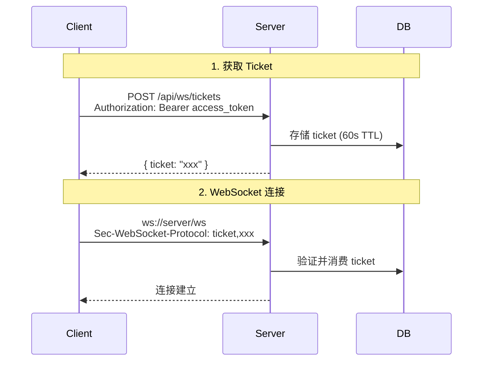

# 方案概述

本文档概述 ChatRoom 的核心设计方案及其设计哲学。

## 设计哲学

### 1. 简洁优先

> "Perfection is achieved not when there is nothing more to add, but when there is nothing left to take away."
> — Antoine de Saint-Exupéry

我们选择：
- PostgreSQL 而非 PostgreSQL + Redis
- 单体架构而非微服务
- 简单方案而非复杂方案

### 2. 安全默认

所有设计决策优先考虑安全：

- Token 有效期默认保守值
- CORS 默认严格校验
- 输入默认清理

### 3. 可观测性内置

不是事后添加监控，而是设计时考虑：

- 每个组件都有指标暴露
- 关键路径都有日志记录
- 错误都有明确的错误码

## 核心方案

### 1. JWT 双 Token 认证

```
┌─────────────────────────────────────────────┐
│              Token 生命周期                  │
├─────────────────────────────────────────────┤
│                                             │
│  登录 ──→ Access Token (15min)              │
│       └──→ Refresh Token (7 days)           │
│                                             │
│  Access 过期 ──→ 用 Refresh 换新 Access     │
│              └──→ Refresh 也轮换            │
│                                             │
│  Refresh 过期 ──→ 重新登录                   │
│                                             │
└─────────────────────────────────────────────┘
```

**优势**：
- Access Token 泄露影响有限（15分钟）
- Refresh Token 轮换，被盗后自动失效
- 用户无感知刷新

### 2. WebSocket Ticket 认证



**优势**：
- Token 不暴露在 URL
- Ticket 一次性消费
- 与房间绑定，防止滥用

### 3. PostgreSQL LISTEN/NOTIFY

```mermaid
flowchart LR
    subgraph Instance1["实例 1"]
        WS1[WebSocket<br/>连接 A, B]
    end

    subgraph Instance2["实例 2"]
        WS2[WebSocket<br/>连接 C, D]
    end

    subgraph PG[(PostgreSQL)]
        NOTIFY[NOTIFY<br/>channel: room:1]
        LISTEN[LISTEN<br/>channel: room:1]
    end

    WS1 -->|消息| NOTIFY
    NOTIFY -->|广播| LISTEN
    LISTEN -->|推送| WS2
```

**优势**：
- 无需额外组件（Redis）
- 事务性消息（与数据库操作原子）
- 自动清理（连接断开自动 UNLISTEN）

### 4. Hub 模式

```
Hub
├── rooms: Map<roomID, Room>
├── register: chan *Client
├── unregister: chan *Client
└── broadcast: chan Message

Room
├── clients: Map<clientID, *Client>
├── join: chan *Client
├── leave: chan *Client
└── broadcast: chan Message
```

**优势**：
- 集中管理连接
- 房间隔离
- 易于扩展

## 技术选型理由

| 选择 | 理由 |
|------|------|
| Go | 并发模型简单，适合 WebSocket |
| Gin | 高性能，生态成熟 |
| GORM | ORM 抽象，减少样板代码 |
| React | 组件化，Hooks 简洁 |
| TypeScript | 类型安全 |
| Vite | 快速开发体验 |
| PostgreSQL | 功能丰富，LISTEN/NOTIFY |

## 架构分层

```
┌─────────────────────────────────────┐
│           Presentation              │  ← React SPA
├─────────────────────────────────────┤
│           API Layer                 │  ← Gin Handlers
├─────────────────────────────────────┤
│           Service Layer             │  ← Business Logic
├─────────────────────────────────────┤
│           Data Layer                │  ← PostgreSQL
└─────────────────────────────────────┘
```

---

下一步：[技术架构](/zh/whitepaper/architecture)

---

🌐 **Languages**: [English](/en/whitepaper/solution) | 简体中文
